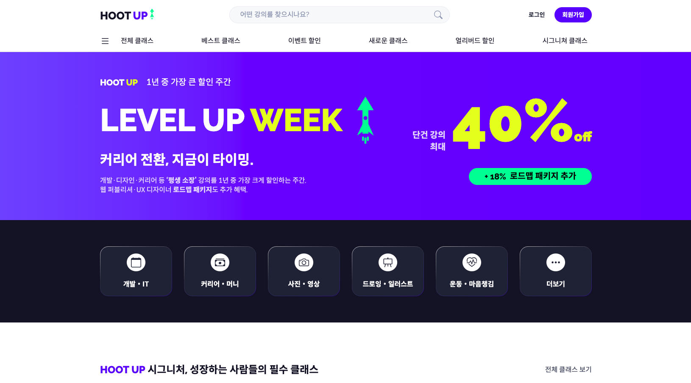

# HOOT UP — 밤에 깨어 배우는 사람들의 아지트

온라인 강의 플랫폼 **훗업(HOOT UP)** 의 정적 웹 퍼블리싱 구현입니다.
브랜드 기획과 디자인을 직접 하고, 구현은 AI 도구로 진행한 뒤 **산출물을 검수**한
가상 브랜드 포트폴리오 프로젝트입니다.

**[▶ 라이브 데모 보기](https://hotshin24.github.io/Hoot-up_claude-code/)**



메인 랜딩 상단 · 로그인 전 상태 (`index.html`)

---

## 이 저장소의 위치

HOOT UP은 **동일한 Figma 원본을 두 개의 AI 파이프라인에 태워, 서로 다른 형태의 결과물로
구현하는** 프로젝트입니다. 두 갈래 모두 코드 생성은 AI가 하고, 요구사항 정의와 검수는 사람이 합니다.
이 저장소는 그중 A안입니다.

| | A안 (이 저장소) | B안 |
|---|---|---|
| 결과물 | HTML / CSS / Vanilla JS 정적 사이트 | Next.js 16 + React 19 애플리케이션 |
| 파이프라인 | Figma → Claude Code → GitHub Pages | Figma → v0 → Cursor → Vercel |
| 학습 상태 | 학습 완료 범위 | 학습 중인 범위 |
| 목적 | 학습 내용 심화 + **AI 산출물 검수 역량 검증** | 미학습 스택 **학습 병행** |
| 저장소 | 현재 위치 | [hootup-v0](https://github.com/reviewelio24-coder/hootup-v0) |

두 갈래를 나눈 기준은 **내가 검수할 수 있는 범위인가**입니다.
A안은 학습을 마친 HTML/CSS 영역이라 AI가 생성한 코드를 읽고 판단하고 반려할 수 있습니다.
B안은 학습 중인 React·Next.js 영역이라 AI를 구현 도구가 아니라 학습 도구로 씁니다.
같은 수준의 검수를 주장하지 않습니다.

---

## 역할 구분

코드는 AI가 생성했습니다. 무엇을 규정했고 무엇을 검수했는지를 밝힙니다.

| 사람이 한 것 | AI가 한 것 |
|---|---|
| 브랜드·콘텐츠 기획, 강의 카탈로그 152강 설계 | HTML 마크업 생성 |
| Figma 디자인 및 변수 체계 구축 | CSS 스타일 작성 |
| 토큰 네이밍 규칙·접근성 요구사항을 PRD로 명문화 | JavaScript 구현 |
| **산출물 검수, 결함 지적, 구조 반려, 수정 지시** | 자기 작업 리뷰 문서 작성 |

검수도 전부 사람 손으로 한 것은 아닙니다.
**무엇을 볼지 정하고, 결과를 판단하고, 반려하는 것은 사람**이 했습니다.
**세고 뒤지고 대조하는 실행은 AI**에 지시했습니다.

이 문서의 정량 수치는 대부분 AI가 측정한 값이고, 그것을 다시 대조해 확정한 것이 사람입니다.
08-13 이후의 재측정 · 재집계에는 `검증 세션`이라고 표기해 구현 세션과 구분했습니다.
누가 쟀는지를 흐리면 이 문서 자체가 검증되지 않은 완료 보고가 됩니다.

---

## 문서 체계

이 README는 **일자별 작업 일지**입니다. 마감 이후 저장소를 전수 재측정해 확정한 사양은
PRD v2.1 · UI/UX 설명서 · 기능정의서 v1.6 세 문서로 관리하며,
수치가 어긋나는 항목은 **재측정본을 확정값으로** 삼습니다.
본 README의 정량 수치도 08-03 재측정 기준으로 갱신했습니다.

---

# 검수 기록

이 프로젝트의 핵심은 완성된 화면이 아니라 **검수 기록**입니다.
검수는 두 층위로 돌아갑니다.

```
[1] 구현 중 실시간 지적 — 생성된 화면·코드를 보며 즉시 반려
[2] 완료 보고 사후 대조 — AI가 쓴 작업 리포트를 실측치와 1:1 대조
```

## 일자별 흐름

| 날짜 | 작업 | 페이지 | 지적 |
|---|---|---|---|
| 07-29 | 랜딩 페이지 구현 | 1 | — |
| 07-30 | 카테고리 시스템 (대분류·세부·할인·큐레이션) | 80 | **21건** |
| 07-31 | 매거진 · 데스크(뉴스) 시스템 | 125 | **24건** |
| 08-01 | Figma 시안 기반 신규 16종 · 컬러 토큰화 | 136 | **35건** |
| 08-02 | 로그인 전/후 분리 · 계정 시스템 · 장바구니 | 152 | **49건** |
| 08-03 | 크리에이터 7종 · 알림 모달 · **링크 404 전량 제거** | **157** | — |
| 08-05 | 진입점 통합 · **하드코딩 색상 전량 토큰화** · DESK 기능 · 모달 공용화 | 157 | **34건** |
| 08-06 | 랜딩 공용화 · 수치 토큰화 · W3C 정리 · **계정 영역 신설** | **159** | **33건** |
| 08-07 | 계정 인터랙션 완성 · 푸터 · 파비콘 · **크리에이터 스튜디오 4종** | **163** | **28건** |
| 08-09 | 크리에이터 인터랙션 마무리 · **반응형 착수 — index 전 섹션** | **164** | **42건** |
| 08-10 | 초소형 반응형 · **전역 가로 스크롤 원인 제거** | 164 | **10건** |
| 08-11 | **반응형 2막 — 페이지 유형 전개** · 버튼 접기 공용화 | 164 | **43건** |
| 08-12~13 | **반응형 3막 — 로그인 이후 영역** · 사이드 메뉴 아코디언 · `ul` 리팩터 | 164 | **40건** |

지적 누계 **359건**입니다.

---

## 2026-07-29 — 랜딩 페이지 구현

메인 랜딩 1페이지를 생성하고 GitHub Pages에 배포했습니다.
착수 전에 요구사항을 문서로 고정하고 시작했습니다.

- 디자인 토큰 체계와 네이밍 규칙 확정
- Figma 파일을 단일 원천(single source of truth)으로 지정
- 이전 프로젝트(JW Anderson)에서 드러난 품질 갭을 PRD 비기능 요구사항으로 명문화

### 검출

| 항목 | 문제 | 조치 |
|---|---|---|
| 콘텐츠 기획서 ↔ Figma | 기획서는 Space Grotesk + Pretendard, 실제 디자인은 Raleway + Spoqa Han Sans Neo | Figma를 단일 원천으로 확정, PRD에 변경 이력 각주 |
| 강의 카드 강사명 | `볌밤코딩 제시` — 카탈로그와 불일치 | `새벽코딩 제이든`으로 정정 |

첫 항목은 **문서와 디자인이 어긋난 상태로 구현이 시작되려던 지점**입니다.
어느 쪽이 맞는지 정하지 않으면 이후 모든 페이지가 잘못된 기준을 따릅니다.

---

## 2026-07-30 — 카테고리 시스템 · 지적 21건

1페이지에서 80페이지로 확장했습니다.
가장 많이 나온 것은 **AI가 요청을 문자 그대로 처리하면서 놓친 부수 효과**입니다.

### 표준 위반

| 지적 | 상황 | 조치 |
|---|---|---|
| 메타 description 끝 `)` 오류 | W3C 검사에서 에러. 육안으로는 정상 | 전 HTML 전수 검사 후 15개 파일 수정 |

마크업 검증을 눈이 아니라 **validator로 돌린 결과** 나온 항목입니다. 화면에 영향이 없어 리뷰만으로는 안 잡힙니다.

### 인터랙션 결함

| 지적 | 상황 | 조치 |
|---|---|---|
| 호버 시 할인 배지 사라짐 | 썸네일 확대 애니메이션이 배지를 덮음 | `position: relative` + `z-index` 고정 |
| 강의명 호버 밑줄 | 링크 기본 스타일 노출 | `text-decoration: none` |
| 페이저 대비 부족 | 활성/호버 상태 구분 약함 | 활성 배경 `--color-neutral-dark`, 호버 텍스트 흰색 |

첫 항목은 **다른 기능을 추가하다 기존 요소를 깨뜨린 회귀**입니다. 변경 주변까지 함께 봐야 잡힙니다.

### 구조 · 리팩터링

| 지적 | 상황 | 조치 |
|---|---|---|
| 인라인 `width`/`height` | `` 태그마다 크기 하드코딩 | **682개 속성 제거**, 같은 크기끼리 CSS 클래스로 관리 |
| `main > div.l-container` 래퍼 | 의미 없는 한 겹이 전 페이지에 존재 | 래퍼 제거하고 클래스를 `main`에 병합 (50개 파일) |

두 번째는 **"왜 div로 한 번 감쌌나"** 라는 질문에서 시작됐습니다. 불필요한 중첩이 80개 페이지에 복제되는 구조였습니다.

인라인 크기 속성은 지우기만 하면 로딩 중 영역이 확보되지 않아 화면이 밀립니다.
CSS 클래스로 크기를 미리 잡아두는 방식으로 제거와 안정성을 함께 처리했습니다.

### 설계 질문 — 반려하지 않은 사례

| 질문 | AI 답변 | 결정 |
|---|---|---|
| "`main`이 모든 페이지에 필요한가? index에만 있으면 되는 것 아닌가" | 문서마다 하나씩 필요하다는 표준 설명 | **변경 없음 유지** |

검수는 전부 지적으로 끝나지 않습니다. 근거가 타당하면 원안을 유지하는 것도 검수 결과이므로,
반려하지 않은 결정도 지적과 같이 기록에 남깁니다.

### 명명 · 연결 정합성

| 지적 | 상황 | 조치 |
|---|---|---|
| 파일명 불일치 | 카테고리는 `러닝 & 유산소`인데 파일명은 `cardio` | `running`으로 변경 + 전 파일 참조 갱신 |
| 자기 링크 미연결 | 대분류 페이지가 자신을 가리키는 링크가 빔 | 전 파일 칩·메가메뉴 링크 전수 연결 |
| 텍스트 불일치 | `재테크 & 머니` ↔ 카탈로그의 `재테크 & 투자` | 전 파일 통일 |

**콘텐츠와 코드가 어긋나는 유형**입니다. 코드만 봐도 화면만 봐도 안 보이고, 원본 기획서와 대조해야 나옵니다.

### 결함을 미리 막는 요구사항 작성

단순 지시가 아니라 **제약 조건을 함께 명시**한 사례입니다.

> "썸네일 이미지에 호버 시 1.3배 커졌다 돌아오는 액션 추가.
> **단, 감싼 레이아웃은 항상 같은 크기여야 함.**"

앞부분만 지시했다면 카드 전체가 커지면서 그리드가 흔들렸을 요청입니다.
뒷문장 때문에 `overflow: hidden` + `transform` 조합으로 구현됐고,
`prefers-reduced-motion` 대응까지 함께 들어갔습니다.

필터 동작도 같은 방식으로 명세했습니다.
dev-it 한 페이지에 대해 규칙을 확정한 뒤 8개 대분류에 공통 적용했습니다.

```
전체 보기 = 얼리버드·이벤트 구분 없이 전체 표시
전체 보기에서는 두 칩 모두 비활성
각 칩은 클릭했을 때만 활성 (chip--brand + aria-current)
세부 카테고리에서는 필터바 자체를 삭제
```

규칙을 먼저 확정하면 어긋났을 때 화면에서 즉시 드러납니다.

### 완료 보고 대조

구현 세션은 작업이 끝나면 스스로 요약 보고를 작성합니다.
**다 했다고 적혀 있는데 열어보면 안 되어 있는 경우**가 있습니다.

| 항목 | 보고 / 실제 | 검출 방법 |
|---|---|---|
| 대분류별 할인 페이지 | **16개 생성 완료** / 실제 14개 | 파일 개수 카운트 |
| 세부 페이지 필터바 제거 | **32개 전체 완료** / 4개 누락 | 잔존 파일 목록 대조 |

두 건 모두 **8개 반복 처리의 마지막 항목(요리·베이킹)이 빠졌고, 둘 다 완료로 보고**됐습니다.
개별 사고가 아니라 배치 작업의 실패 패턴이라고 판단해, 이후 작업에는 개수 검증을 고정 절차로 넣었습니다.

```bash
# 배치 작업 후 반드시 실행
ls category-*-earlybird.html | wc -l   # 기대값 8
ls category-*-event.html | wc -l       # 기대값 8
```

---

## 2026-07-31 — 매거진 · 데스크 시스템 · 지적 24건

매거진 12페이지와 데스크(뉴스) 33페이지를 추가해 80 → 125페이지로 확장했습니다.
뉴스 기사 173건을 5개 카테고리로 나누고 페이지네이션을 재설계했습니다.

이날의 지적은 성격이 달라졌습니다. **"틀렸다"가 아니라 "일부만 됐다"** 가 절반 이상입니다.

### 부분 반영 검출

| 지적 | 상황 |
|---|---|
| 활성 기간 칩 폰트색 미적용 | 지시대로 규칙을 넣었으나 화면에 반영되지 않음 |
| 이미지 라운딩 desk.html 누락 | "전체 적용" 후에도 desk.html만 빠짐 |
| 기사 상세 링크 미연결 | 링크 작업 완료 보고 후에도 desk.html에는 미부착 |

세 건 모두 **완료 보고 이후에 발견**됐습니다.
어제의 "16개 완료 / 실제 14개"와 같은 계열이고, 이날은 같은 유형이 세 번 반복됐습니다.
이미지 라운딩은 결국 **뉴스 카테고리 → desk.html → desk-ai-coding.html 세 번에 나눠 지시**해야 했습니다.

### 원인 진단과 규칙화

활성 칩 폰트색이 먹지 않는 문제는 값을 바꿔서 해결되지 않았습니다.

```
.desk-page a { color: inherit }   /* 명시도 (0,1,1) */
.desk-period__chip--active { }    /* 명시도 (0,1,0) — 덮임 */
```

테마 스코프의 포괄 규칙이 컴포넌트 색상을 반복적으로 덮고 있었습니다.
같은 원인이 활성 페이저 번호, 기간 칩, 프로모 버튼 세 곳에서 동시에 발생했습니다.
`.desk-page a.<class>` 형태로 **명시도를 올려 통일**해 해결했습니다.
증상만 지적했다면 세 번 따로 고쳤을 문제입니다.

### 정보 구조 재정의

| 지적 | 상황 | 조치 |
|---|---|---|
| 중복 진입 파일 | `desk-<cat>.html`과 `desk-<cat>-1.html`이 동일 내용 | **"똑같은 파일이 2개일 필요 없잖아"** — 진입점을 `-1`로 통일, 중복 5개 삭제 |

사이드바·상단 내비·페이저 참조를 전부 `-1`로 재연결했습니다. 동작에 문제가 없던 구조를 **중복이라는 이유로 걷어낸 판단**입니다.

### 디자인 규칙 통일 — 롤백 포함

| 지적 | 조치 |
|---|---|
| 이미지 라운딩 `--radius-md` 통일 | 뉴스 피처 · desk 이미지 3종 · 기사 상세 3종 · 기자 소개 박스 |
| **소형 썸네일만 롤백** | `.desk-class__thumb`은 20px가 과해 기존 3px로 되돌림 |
| 버튼 규칙 통일 | `.desk-promo__btn`을 `.enroll-card__btn--primary` 규칙으로 정렬 |
| 페이저 컴포넌트 통일 | 데스크 뉴스 페이저를 코스 카테고리와 동일한 공용 `.pager`로 |
| 구분선 정리 | `.site-header`에 하단 보더 추가 / `.desk-artbar` 하단 보더 제거 |
| 호버 효과 통일 | index 뉴스·블로그 이미지에 강의 카드와 동일한 `scale(1.3)` 적용 |

두 번째 항목이 요점입니다. 일괄 적용을 지시한 뒤, 소형 요소에서 결과가 나쁜 것을
확인하고 자기 지시를 되돌렸습니다. 규칙 일관성보다 실제 결과를 우선한 판단입니다.

### 데이터 정합성

표시되는 숫자와 실제 데이터를 대조했습니다.

| 지적 | 조치 |
|---|---|
| 카테고리별 기사 수 | 사이드바 카운트를 실제 건수로 교체 (43 / 34 / 36 / 30 / 30) |
| 전체 합계 | **173** 으로 통일 (= 43+34+36+30+30), 31개 파일에 일괄 반영 |
| 오늘 업데이트 배지 | 실제 발행 건수로 갱신 (14 → 4) |

### 복합 사양 지시

단순 요청이 아니라 **규칙을 먼저 정의하고 전 범위에 적용**한 사례입니다.

```
페이지네이션
  한 페이지 9~12건
  날짜 그룹은 통째로 유지
  9~12 규칙을 못 맞추는 경우에만 한 날짜를 페이지 경계에서 분할
  진입은 항상 1페이지(-1)

슬라이딩 윈도우 페이저
  번호는 최대 10개만 노출
  11페이지부터 창이 한 칸씩 이동 (11 → 2–11 … 15 → 6–15)
```

30·34·36·43건에서 "날짜 그룹 유지 + 9~12건"이 동시에 성립하지 않는 경우가 있어 **최소 분할 원칙**으로 해소했습니다.

### 완료 보고 대조

이날 보고된 수치는 전수 검증에서 **전부 일치**했습니다.

| 항목 | 보고 | 실측 |
|---|---|---|
| Tech·AI / Career / Dev·IT / Interview / Data | 43 / 34 / 36 / 30 / 30 | 동일 ✅ |
| 전체 통합 페이지 기사 수 | 173 | 173 ✅ |
| 중복 진입 파일 삭제 | 5개 | 5개 삭제 확인 ✅ |
| 사이드바 카운트 반영 | 전 데스크 페이지 | 31개 파일 확인 ✅ |

07-30에 도입한 개수 검증 절차가 적용된 결과로 봅니다.

---

## 2026-08-01 — Figma 시안 기반 16종 신설 · 지적 35건

Figma 시안을 직접 지정해 회사·크리에이터·고객센터·정책 페이지 16종을 신설했습니다.
이날은 지적의 성격이 또 달라졌습니다. 개별 결함보다 **규칙 수립과 미해결 항목 정리**가 중심이었습니다.

### Figma 노드 단위 지시

시안을 노드 ID로 지정해 16종을 순차 생성했습니다.

```
[209-31719] b2b            [209-35536] notice
[209-32939] careers        [209-35834] faq        + md 콘텐츠
[209-33376] roadmap        [211-26126] terms
[209-33759] subscribe      [211-27116] privacy
[209-34075] creator-apply  [211-27610] refund
[209-34486] creator-guide  [210-23441] youth
[209-34738] creator-studio [210-23593] business
[209-34990] creator-settlement
[209-35329] creator-mentor
```

FAQ는 **디자인은 Figma, 콘텐츠는 md 파일**로 출처를 분리해 지시했습니다.
이용약관은 당초 노드(209-36168)가 부적합해 신규 노드(211-26126)로 교체 지시했습니다.

### 하드코딩 색상 토큰화

07-31 시점에 하드코딩 색상이 21건까지 늘어난 상태였습니다.
새 페이지를 만들기 전에 이것부터 정리하고 시작했습니다.

| 지시 | 조치 |
|---|---|
| "토큰으로 변환 안 된 컬러 확인 후 수정" | roadmap STEP 라벨 등 순차 치환 |
| "brand-story 블록도 토큰화해" | 브랜드 스토리 CSS 블록 전환 |
| **"범위 밖 기존 사이트 CSS에 있던 `#0d3d94` 1곳은 어디?"** | 위치 특정 후 흡수 |
| "`tokens.css`에 `--color-brand-dark` 신설해 이 값까지 토큰화" | 토큰 신설 → 10곳 치환 |

세 번째 지시가 요점입니다. **작업 범위 밖에 남은 값 하나까지 추적**해 토큰을 신설하고 흡수시켰습니다.
부분 정리로 끝내지 않고 원인을 없앤 처리입니다. b2b·careers는 각각 컨펌 후 순차 실행했습니다.

### 재사용 패턴 확립 — 컴파운드 클래스

정책 페이지 5종이 같은 레이아웃 계열이라는 점을 이용해,
**`class="terms <scope>"` 컴파운드 클래스로 스타일을 상속**하는 패턴을 세웠습니다.

```html
<main class="terms">           <!-- terms.html -->
<main class="terms privacy">   <!-- privacy.html -->
<main class="terms refund">    <!-- refund.html -->
<main class="terms youth">     <!-- youth.html -->
<main class="terms business">  <!-- business.html -->
```

`.terms`에 단독 base 규칙이 없고 전부 descendant 규칙이라 안전하게 상속됩니다.
**완성된 terms 페이지를 한 줄도 고치지 않고** 뒤따르는 4종이 히어로·목차·표·contact를 재사용했습니다.

### 클래스 충돌 검출

| 지적 | 상황 | 조치 |
|---|---|---|
| FAQ 아코디언 동작 이상 | 신규 `faq__` 클래스가 기존 강의상세 FAQ 클래스와 충돌 | `faq__` → `hfaq__` 전면 리네이밍 (274회) |

136개 페이지 규모에서는 **새 컴포넌트 이름이 기존 것과 겹치는 사고**가 발생합니다.
고유 프리픽스로 해결했고 `faq.html` 내 `faq__` 잔존은 0건입니다.

### 반복 지시의 누적

같은 성격의 지시가 여러 페이지에 걸쳐 반복됐습니다.

| 지시 | 적용 범위 |
|---|---|
| 화살표 → 로켓 이미지 치환 | subscribe 9개 · creator-guide 18개 · mentor 4개 · notice 1개 |
| 다크 CTA ↔ 푸터 경계 보더 | roadmap · subscribe · creator-apply · faq · business |
| 시맨틱 클래스 리네이밍 | "class명 의미있는 단어로 리네이밍해줘" |

두 번째는 **"100% 전체 꽉 차는 보더"** 라는 조건까지 명시했습니다. 07-30의 썸네일 지시와 같은 방식입니다.

### 세부 마감 지적

| 지적 | 조치 |
|---|---|
| B2B 문구 | `148개 클래스` → `150여 개의 클래스` |
| FAQ 이모티콘 | 페이지 내 전량 삭제 (현재 0개) |
| FAQ CTA 문구 | `후트해 주세요` → `문의해 주세요` |
| notice CTA | `오늘도 다시 후트라이` → `AI 클래스 보러가기` + 링크 연결 |
| subscribe 고스트 버튼 | `무료로 후트라이` 삭제 · 카테고리 이모지 삭제 |
| 검색 인풋 X 버튼 | `::-webkit-search-cancel-button` 숨김 |
| 로드맵 강의 제목 | 데모 상세 링크 + `text-decoration: none` + 호버색 (`brand-darker` → 화이트로 재지시) |

로드맵 호버색은 한 번 지시한 뒤 결과를 보고 화이트로 바꿨습니다.
07-31의 소형 썸네일 롤백과 같은 계열 — 규칙보다 실제 결과를 우선한 판단입니다.

세 번째와 다섯 번째는 **브랜드 톤이 기능 이해를 방해하는 지점에서의 양보**입니다.
사용자가 다음 행동을 판단해야 하는 문구에서는 일반어로 되돌렸습니다.

### 완료 보고 대조

| 항목 | 보고 | 실측 |
|---|---|---|
| 신규 페이지 | 16종 | **16종 전부 확인** ✅ |
| `--color-brand-dark` 신설 | `tokens.css` | 선언 확인, 10곳 치환 ✅ |
| 컴파운드 클래스 재사용 | 정책 5종 | `class="terms *"` 5종 확인 ✅ |
| FAQ 리네이밍 | `faq__` → `hfaq__` | 274회 치환, 잔존 0 ✅ |
| FAQ 이모지 삭제 | 전량 | 0개 ✅ |

불일치 없음. 07-31에 이어 이틀 연속입니다.

### 커밋 컨벤션 도입

이날부터 커밋 메시지에 유형 접두어를 붙이기 시작했습니다.

```
feat : 사업자정보 확인 페이지 생성
style : 브랜드 스토리 컬러 하드코딩을 토큰으로 변환
fix : 해당 메뉴 두 번째 클릭시 404 오류 해결
```

08-01 커밋 34건 중 33건이 `feat` / `style` / `fix` 형식입니다.
이전 117건에는 접두어가 없어, 히스토리 후반부부터 규칙이 적용된 형태입니다.

---

## 2026-08-02 — 로그인 이후 서비스 화면 · 지적 49건

로그인 전/후를 분리하고, 계정(마이 둥지) 9종 · 장바구니 · 크리에이터 홈을 신설했습니다.
정적 사이트에서 **상태를 가진 화면**으로 넘어간 날입니다.

이날의 지적은 두 축이었습니다. **중복 제거**(토큰·구간·명칭)와 **데이터 정합성 검증**입니다.

### 중복 토큰 통합

| 지적 | 조치 |
|---|---|
| **"`--color-brand-base`와 `--desk-accent`가 결국 같은 컬러인데 토큰명이 다르게 지정. 비효율적이야. 하나로 통일하고 이런 사례가 더 있는지 전수 조사해서 변경해줘."** | `--desk-accent` 제거, `--color-brand-base`로 일원화 (잔존 0건) |
| "컬러 외 다른 속성들은 다른 이름으로 중복 적용된 게 없어?" | 폰트 관련 중복 토큰 통합 |

**한 건을 발견하고 전수 조사를 지시한 것**이 요점입니다. 개별 수정으로 끝내지 않고 같은 유형을 찾게 했습니다.

미디어쿼리도 같은 방식으로 정리했습니다.

```
모바일    max-width: 767px
태블릿    768px – 1279px
데스크탑  min-width: 1280px
```

다만 **"일단 구간만 정리, 구간별 디자인은 계정 페이지 완성 후"** 라고 범위를 명시했습니다.
정리와 구현을 한 번에 하지 않고 순서를 나눈 판단입니다.

이때 잡은 3구간은 08-09 반응형 착수 시점에 **1280 / 768 / 480 데스크톱 우선 3단으로 재정의**됩니다.
실제 배치가 세 단계로 갈려 767/1279 두 경계로는 나눌 수 없었기 때문입니다.

### 데이터 정합성 검증

계정 페이지는 **기존 카탈로그와 어긋나면 즉시 티가 나는** 화면입니다.
152개 강의 카탈로그를 기준 데이터로 두고 전수 검증했습니다.

| 지적 | 검출 |
|---|---|
| **"'왕초보 엑셀 데이터 정리 실무' 같은 게 152개 안에 있어? 없으면 있는 걸로 바꿔"** | 카탈로그에 없는 강의명이 데모 데이터로 생성됨 → 실제 강의로 교체 |
| **결제방식 규칙 검증** | 개발&IT·커리어&머니 = 단건 / 디자인&크리에이티브 = 구독+단건 / 나머지 5분야 = 구독 전용. 내 클래스·위시리스트·주문내역이 규칙과 어긋나는지 전수 확인 |
| 구독료 오류 | `subscribe.html` 연 199,000원(월 16,583원)이 올나잇 패스 페이지 기준과 불일치 → 정정 |
| 프로모 절약액 오류 | "4개를 지금 사면 178,400원 아껴요" — 실제 합산값과 불일치 → 정정 |
| 가격·할인율 | 위시리스트·주문내역 카드를 카탈로그 실제가와 대조 |

첫 항목이 특히 중요합니다. **AI가 그럴듯한 강의명을 지어낸 것**을 카탈로그와 대조해 잡아냈습니다.
화면상으로는 전혀 이상하지 않은 데이터입니다.

두 번째는 한발 더 나아간 검증입니다. 개별 데이터가 아니라
**카테고리별 결제방식이라는 비즈니스 규칙**을 정의하고 여러 페이지에 교차 확인시켰습니다.

### 시안 정합 반려

| 지적 | 항목 |
|---|---|
| **"시안을 줘도 딱딱 못 맞추냐"** | ① 사이드바 디자인 ② 올나잇 패스 박스 그라디언트 ③ 보유 쿠폰 하단 마진 ④ 쿠폰 박스 border-radius ⑤ 로그인 라우팅 |
| 내 클래스 구조 오류 | 카드 21개 중 4개 초과 · 페이저가 3×3 배열 아님 · 탭별 분류 미동작 |

Figma 노드를 지정했는데도 결과가 어긋난 사례입니다. **한 번에 5개 항목을 열거해 반려**했습니다.

### 명칭 체계 — 브랜드 컨셉 적용

기능 명칭을 브랜드 컨셉(둥지)으로 통일했습니다.

| 기존 | 변경 |
|---|---|
| 내 계정 | **마이 둥지** |
| 수료증 | **졸업모(수료증)** |
| 위시리스트 | **찜한 둥지(위시리스트)** |
| 장바구니 | **담은 둥지(장바구니)** |

괄호 안 원명은 작은 크기·얇은 웨이트(`.gown-sub`)로 처리해 브랜드 표현과 기능 인지를 함께 유지했습니다.
브랜드 용어만 쓰면 기능을 못 찾고, 원명만 쓰면 컨셉이 사라지는 지점입니다.

### 오작업 정정

| 지적 | 상황 |
|---|---|
| **"작업 틀렸어. `magazine.html` 링크를 삭제한 뜻이지 페이지 자체를 삭제하란 뜻이 아니었어"** | 지시를 확대 해석해 페이지를 삭제 → 원본 복구 후 링크만 분리 |

**지시 범위를 넘어선 작업**을 즉시 잡아낸 사례입니다. 복구 방향까지 함께 지시했습니다.

### 반복 확인으로 원인 추적

매거진 영문 폰트 통일은 한 번에 끝나지 않았습니다.

```
"어떤 게 Raleway야?"
  → "매거진 내 모든 영문 폰트를 Raleway로 변경"
  → "폰트 사이즈도 다른 것 같아, 둘 다 desk와 통일"
  → "mag font-weight가 더 두꺼워, 다른 곳에 다른 속성이 있는지 찾아봐"
```

마지막 지시가 요점입니다. 값을 다시 바꾸라고 하지 않고
**다른 곳에 덮어쓰는 속성이 있는지 찾으라고** 지시했습니다. 07-31의 명시도 진단과 같은 접근입니다.

콘텐츠 폭도 같았습니다. `"1170px 같은데 맞아?"` → `"표준 1160px로"` →
`"l-container처럼 min(1160px, 100%−40px) 방식으로 통일"`.
값 지정에서 **기존 표준 방식 재사용**으로 지시가 올라갔습니다.

### 동작 원리 확인

| 질문 | 맥락 |
|---|---|
| "장바구니가 실제처럼 작동하려면 백엔드를 연결해야 하는 거지?" | 정적 사이트에서 구현 가능한 범위를 확인 |
| "account-notifications 토글은 왔다 갔다 해야 하지 않을까?" | 단방향 토글 검출 → `js/toggle.js` 왕복 구현 |

첫 번째는 결함 지적이 아니라 **구현 한계 확인**입니다.
정적 사이트에서 어디까지가 가능한지를 파악한 뒤 데모 범위를 정했습니다.

### 완료 보고 대조

| 항목 | 보고 | 실측 |
|---|---|---|
| `categories.html` 152개 클래스 | 152 | **152** ✅ |
| 중복 토큰 통합 | `--desk-accent` 제거 | 잔존 **0건** ✅ |
| 계정 사이드바 재사용 | 9종 공통 | `account-nav` 9/9 ✅ |
| 명칭 통일 | 4종 | 마이 둥지 20 · 졸업모 29 · 찜한 둥지 12 · 담은 둥지 8 ✅ |
| 매거진 편수 정정 | 9·5·5·6·5·5·5·5 | 합계 45편 ✅ |
| **신규 JS** | **4종** | **8종** ⚠️ |

마지막 항목은 **과소 보고**입니다.
리뷰는 `search` · `cart` · `toggle` · `cert` 4종을 적었지만,
실제로는 `auth-modal` · `myclass-tabs` · `order-tabs` · `mag-more`가 함께 추가돼 8종입니다.

지금까지 검출된 보고 오류는 전부 **실제보다 부풀린** 방향이었는데(16개 완료/실제 14개),
이번은 반대입니다. 방향과 무관하게 보고와 실측은 대조해야 한다는 점은 같습니다.

---

## 2026-08-03 — 크리에이터 스튜디오 완결 · 데스크탑 전 페이지 마감

크리에이터 측 관리 화면 7종을 추가해 **데스크탑 버전의 전 페이지 생성과 연결을 완료**했습니다.

| 페이지 | 파일 |
|---|---|
| 공개 프로필 | `creator-profile.html` |
| 내 클래스 관리 | `creator-classes.html` |
| 수강생 리뷰 | `creator-reviews.html` |
| 질문 관리 | `creator-questions.html` |
| 수익 정산 | `creator-revenue.html` |
| 정산 계좌·세금 | `creator-tax.html` |
| 스튜디오 예약 | `creator-studio-booking.html` |

크리에이터 홈의 빈 링크를 전부 연결해,
**홈 → 각 관리 화면 동선이 끊기지 않도록** 마감했습니다.

### 지적 사항 반영 — 로고 링크

| 지적 | 상황 | 조치 |
|---|---|---|
| **헤더 로고 재클릭 시 404** | `site-header__logo`의 `href="/"`가 GitHub Pages 하위 경로를 무시하고 도메인 루트로 이동 | **157개 전 페이지**를 `href="index.html"`로 수정 |

사이트 어디서든 로고를 누르면 홈이 아니라 배포 루트로 빠지던 문제입니다. 첫 클릭이 로고인 방문자가 많아 노출도가 높았습니다.

### 알림 드롭다운 — 마지막 미구현 링크 해소

헤더 벨 아이콘이 `/notifications`로 이동하던 구조를,
**페이지 이동 없이 헤더 안에서 열리는 팝오버**로 교체했습니다.

| 항목 | 구현 |
|---|---|
| ARIA | `aria-haspopup="dialog"` · `aria-expanded` · `aria-controls` · 패널 `role="dialog"` |
| 키보드 | Esc로 닫고 **트리거로 포커스 복귀** |
| 바깥 클릭 | 캡처 단계 리스너로 감지, 패널 밖 클릭 시 닫힘 |
| 배지 동기화 | "모두 읽음" 클릭 시 안 읽음 0 → **배지 자체를 `hidden` 처리** |
| 리스너 정리 | 닫을 때 `document` 리스너 해제 (누수 방지) |
| XSS 방어 | 알림 텍스트를 `innerHTML` 주입 전 이스케이프 |
| 적용 범위 | 로그인 후 156개 페이지 전체 (비로그인 `index.html`은 아이콘 자체가 없어 제외) |

**배지 동기화가 요점입니다.** 안 읽음이 0이 되면 `0`을 표시하는 게 아니라 배지를 숨깁니다.
`0`이 남으면 스크린리더가 "0건 읽지 않음"을 계속 읽고, 시각적으로도 알림이 있는 것처럼 보입니다.

### 링크 마감 — 404 유발 링크 0건

프로젝트 초기부터 누적된 루트 절대경로 링크를 전부 정리했습니다.
`href="/..."`는 GitHub Pages의 하위 경로(`/Hoot-up_claude-code/`)를 무시하고
도메인 루트로 이동해 404를 반환하던 구조입니다.

| 단계 | 잔존 | 처리 |
|---|---|---|
| 07-31 | 3,389 | — |
| 08-01 | 573 | 신규 페이지 구현으로 플레이스홀더 해소 |
| 08-02 | 193 | 계정·장바구니 페이지 실제 구현 |
| 08-03 | 165 | 로고 링크 157건 → `index.html` |
| 08-03 | 9 | 알림 링크 156건 → 드롭다운으로 대체 |
| 08-03 | 7 | 로그인·회원가입 → `<button>` 전환 |
| 08-03 | **0** | 잔여 7건 개별 처리 |

마지막 7건은 성격에 따라 두 가지로 나눠 처리했습니다.

**대응 페이지가 있는 5건 → 실제 경로로 연결**

```
sitemap.html          /about  /chart  /events
creator-studio.html   /creator/studio/reserve → creator-studio-booking.html
PDP                   /wishlist → account-wishlist.html
```

**대응 페이지가 없는 2건 → `<button type="button">` 전환**

`subscribe.html`의 월간·연간 결제 버튼입니다.
정적 사이트에서 결제 플로우는 구현 범위 밖이라 연결할 페이지가 없습니다.
`href="#"`는 "눌러도 아무 일이 없는 링크"지만, 버튼으로 바꾸면
**동작 요소인데 아직 핸들러가 없다**는 정직한 마크업이 됩니다.

### 모달 트리거 시맨틱 교체

로그인·회원가입 트리거도 같은 원칙으로 정리했습니다.

```html
<!-- 이전 -->
<a class="user-menu__auth" href="/login" data-open-login>로그인</a>

<!-- 이후 -->
<button class="user-menu__auth" type="button" data-open-login
        aria-haspopup="dialog" aria-controls="login-modal">로그인</button>
```

링크로 두면 세 가지가 어긋납니다. 스크린리더가 "링크"로 읽지만 페이지 이동이 없고,
우클릭 → 새 탭이 404로 가며, `href` 자체가 배포 환경에서 깨집니다.

CSS는 새 클래스를 만들지 않고 기존 선택자에 `appearance: none` · `border: 0` ·
`font-family: inherit` · `cursor: pointer`를 병합해 **시각적 변화 없이** 처리했습니다.

이로써 메가 메뉴 · 알림 드롭다운 · 인증 모달 · 결제 버튼까지
**"이동이 아니면 링크로 쓰지 않는다"는 원칙**이 사이트 전역에 적용됐습니다.

### 데이터 정합 마감

| 지적 | 조치 |
|---|---|
| 평점 평균 부정확 | 카드별 별점·평균값을 실제 데이터와 재대조 |
| 개설 클래스 수 부정확 | 크리에이터별 개설 클래스 수를 카탈로그 기준으로 정정 |
| 유저 메뉴 숫자 뱃지 위치 | 장바구니·알림 뱃지 정렬 수정 |

08-02의 카탈로그 대조 연장선입니다. 숫자가 표시되는 자리마다 **실제 데이터와 일치하는지 확인**했습니다.

### 자기 집계 재검수 — 하드코딩 색상 131 → 180

마감 시점에 **자기 집계 기준 자체를 검수**했습니다.
남의 완료 보고는 계속 대조하면서, 정작 자기가 세던 수치의 기준은 대조한 적이 없었습니다.

| 구분 | 건수 |
|---|---|
| 16진수 표기 | **144** (gradient 53 · 단색 91 · 고유 75색) |
| 브랜드색 `rgb()` 십진 표기 | **36** |
| 합계 | **180** |

종전 공표 131건은 **16진수만 집계한 수치**였습니다.
`rgb(22 103 250 / α)` 형태의 브랜드색 알파 사용분 36건이 빠져 있었습니다.
흑백 알파값은 사용처별 투명도라 색상 토큰 대상에서 제외했습니다.
집계 스크립트를 고정한 뒤 재측정해 **180건으로 상향 정정**합니다.
기준이 틀린 채로 줄어든 숫자보다 기준이 맞는 큰 숫자가 낫다고 판단했습니다.

> **08-13 후주** — 이 180건도 최종 수치가 아니었습니다.
> 커밋을 되짚어 동일 조건(주석 제거 · 토큰 선언줄 제외)으로 재집계한 08-03 값은
> **16진수 132 · 브랜드색 `rgb()` 73 · 합계 205**입니다.
> 여기서 고친 것은 "무엇을 셀 것인가"였고, "어떻게 셀 것인가"는 그대로였습니다.
> 기준을 두 축으로 넓히면서 집계 스크립트를 고정했다고 적었지만,
> 그 스크립트가 실제로 두 축을 다 도는지는 확인하지 않았습니다.

---

## 2026-08-05 — 인프라 정비 · DESK 기능 · 모달 공용화 · 지적 34건

커밋 18건(11:16 ~ 23:52). 오전은 진입점 · 토큰 · 미디어쿼리 정비, 오후 이후는 매거진 · 데스크
콘텐츠와 기능 신설입니다.

이날 가장 큰 변화는 **16진수 표기 색상이 132건에서 4건이 된 것**입니다.
07-30부터 계속 남아 있던 항목이었습니다.

### 하드코딩 색상 — 16진수 132 → 4

지시는 치환이 아니라 조사부터였습니다.

> "컬러 중 토큰 정의 안 된 것들 조사부터."
> → "1+2번으로 하고 1회성 장식은 비슷한 토큰으로 치환."

**두 갈래로 나눈 지시**입니다. 대응 토큰이 있는 값은 매칭하고, 1회성 장식값은 가장 가까운
토큰으로 흡수시켰습니다. 08-03에 등재해둔 해소 방향과 같은 판단입니다.

| 항목 | 작업 전 | 작업 후 |
|---|---|---|
| `style.css` 16진수 표기 | 132건 | **4건** |
| `style.css` 브랜드색 `rgb()` 표기 | 73건 | **78건** (감소하지 않음) |
| 합계 | 205건 | **82건** |
| 자동 nearest 매핑 오류 | — | 색상(hue)을 잘못 고른 **6건** 수동 보정 |
| 토큰 편입 | — | 매거진 다크 토큰 3종(`--color-magazine-bg/panel/card`)을 전역 토큰으로 이관 |

이날 처리된 것은 16진수 축 하나뿐입니다.
08-03에 기준을 상향하며 두 축(16진수 + 브랜드색 `rgb()`)으로 정의해놓고,
정작 치환은 16진수만 돌렸습니다. 브랜드색 `rgb()`는 오히려 73 → 78로 늘었습니다.
당일에는 이 사실을 확인하지 않고 "합계 0건"으로 기록했고, 08-13 재측정에서 드러났습니다.
자기 집계 기준을 08-03에 고쳐놓고도 그 기준으로 결과를 검산하지 않은 것이 원인입니다.

자동 매핑 6건도 요점입니다. 거리 기준으로 가장 가까운 색을 고르면 명도는 맞아도
색상이 어긋납니다. 스크립트가 만든 결과도 대조 대상이라는 점에서, AI 산출물 검수와 성격이 같습니다.

### 명시도 충돌 재발 — 07-31과 같은 원인

07-31에 데스크에서 진단했던 문제가 매거진 스코프에서 그대로 재발했습니다.

```
.magazine-page a { color: inherit }   /* (0,1,1) */
.mag-pager 활성 번호 · mag-cover__more  /* 덮임 */
```

두 건 다 완료 보고 뒤에 발견됐습니다.

> "페이저 폰트 컬러를 호버 시 컬러와 통일" → **"안 바뀌었는데?"**
> "텍스트 컬러를 언더라인 컬러와 통일" → **"아직도 화이트임"**

`.magazine-page a.<class>` (0,2,1) 패턴으로 해결했습니다. 07-31의 `.desk-page a.<class>`와
동일한 처방입니다.

같은 원인이 다른 테마 스코프에서 반복된다는 것은 **처방이 아니라 규칙이 필요한 지점**이라는 뜻입니다.
테마 스코프에 포괄 규칙(`a { color: inherit }`)을 두는 한 컴포넌트 색상은 계속 덮입니다.

### 진입점 통합

| 항목 | 조치 |
|---|---|
| `import.css` 신설 | `<head>`의 폰트 · 토큰 · 스타일 로드를 단일 진입점으로 정리 |
| `common.js` 신설 | `nav` · `search` · `notifications` 3개 IIFE를 하나로 통합 |
| 미디어쿼리 통합 | 767 / 1279 / `reduced-motion` 단일 블록으로 정돈 (캐스케이드 보존) |

미디어쿼리는 08-02에 구간만 표준화하고 배치는 컴포넌트 옆에 둔 상태였습니다.
이날 구간별로 모으면서 **캐스케이드 순서를 보존**하는 것이 조건이었습니다.
순서가 바뀌면 나중 규칙이 앞 규칙을 덮는 관계가 깨집니다.

### 구조 질문 — 제거로 이어진 것

07-30의 `main > div.l-container` 래퍼 제거와 같은 계열입니다.

| 질문 | 결과 |
|---|---|
| "`magazine-page__inner` 꼭 필요해?" | full-bleed 배경 + 가운데 칼럼 2겹 구조 — **유지** |
| "main 안에 section 여러 개 써도 돼?" | 정석, `div` 불필요 — **확인** |
| "카테고리 `mag-section` 없이 `ul`만 돼?" | **9개 페이지 래퍼 제거**, `aria-label`을 `.mag-grid` ul로 이관 |

세 번째는 **중복 랜드마크 제거**입니다. `section[aria-label]` 안에 목록이 하나뿐이면
랜드마크가 두 겹이 되어 보조기기 탐색에서 의미 없는 정지가 생깁니다.

첫 번째는 유지 결정입니다. 07-30의 `main` 질문과 마찬가지로, 근거가 타당하면 원안을 남깁니다.

### 스크립트 · 폰트 로딩

> "`<script defer>`가 왜 `</body>` 위에 있어? head에 있어야지."

`defer`는 위치와 무관하게 파싱 후 실행되므로, `<head>`에 두면 다운로드만 앞당겨집니다.
**157개 HTML 전량**을 이동했고, 인라인 스크립트 3종(faq · notice · creator-guide)은
`DOMContentLoaded` 래핑 후 옮겼습니다.

폰트는 `@import` 직렬 체인이 병목이었습니다.

```
이전   style.css → @import 폰트     (직렬)
이후   각 <head>에 <link> 직접       (병렬) + Spoqa preconnect
```

`import.css`는 토큰 · 스타일만 남기고 폰트 로드를 분리했습니다.

### 알림 트리거 — 시맨틱 한 겹 더

08-03에 알림을 팝오버로 바꾸면서 `href`는 제거했지만, 태그는 `<a>`로 남아 있었습니다.
이날 `<button>`으로 교체하고 `aria-expanded`를 붙였습니다.

`aria-controls`는 패널이 JS로 생성되는 구조라 **런타임에 이관**했습니다.
정적 HTML에 존재하지 않는 id를 가리키면 W3C 검사에서 오류가 나기 때문입니다.

"이동이 아니면 링크가 아니다"가 08-03에는 `href` 수준에서, 이날 태그 수준까지 적용됐습니다.

### HOOT UP DESK — 정렬 · 랭킹 · 필터

지시가 네 번에 걸쳐 정교해진 사례입니다.

```
"많이 본 순 버튼 작동하게"        → 조회수 데이터 34건 시안
"그 데이터 줄게"                  → 173건 전체로 재작업
"페이저가 상단으로 가"            → insertBefore로 하단 고정
"많이 본 순 2페이지에 최신순이 나와" → 스코프별 전체 랭킹 + 클라이언트 페이지네이션
"기간 버튼도" · "기자 버튼도"      → 스코프 · 기간 · 기자 AND 결합
```

네 번째가 핵심 지적입니다. 정렬 버튼은 화면상 정상 동작했지만, 2페이지로 넘어가면
정적 페이저가 최신순 문서를 불러왔습니다. 정렬은 클라이언트, 페이징은 서버(정적 파일)라
두 축이 어긋난 구조였습니다.

부분 수정 대신 **전체 조회수 랭킹 + 클라이언트 페이지네이션(20/페이지)** 으로 설계를 바꿨습니다.
`js/desk-news-data.js`에 173건 데이터를 두고, 31개 desk 페이지에 `data-views` ·
`data-desk-scope`를 주입했습니다. 랭킹 모드에서는 카드 피드와 정적 페이저를 숨깁니다.

### 모달 공용화 — 4페이지 1스크립트

데스크 뉴스레터 모달을 만든 뒤 매거진에서 같은 요청이 나왔습니다.

> "매거진 구독 버튼도 뉴스와 똑같은 모달."

복제 대신 **`js/subscribe-modal.js` 하나로 일반화**했습니다.

```
트리거   [data-open-subscribe]  (aria-controls = 모달 id)
폼       [data-subscribe-form]
완료     .subscribe-done
```

| 페이지 | 모달 | 필드 |
|---|---|---|
| desk | 뉴스레터 구독 | 이메일 |
| magazine | 매거진 구독 | 이메일 |
| b2b | 도입 문의 | 회사명 · 담당자 · 연락처 · 카테고리(라디오 8) · 문의내용 |
| careers | 지원 | 이름 · 이메일 · 연락처 · 지원분야(라디오 6) · 파일첨부 · 하고싶은말 |

열기 · 닫기(X · 배경 · Esc) · 완료 문구 · 폼 리셋을 공용 처리하고,
스타일은 기존 로그인 · 회원가입 모달(`.modal` · `.signup__*`)을 재사용했습니다.

**구독 폼 501 오류**는 정적 서버에 POST 핸들러가 없어 발생했습니다.
`method="post"`를 제거하고 데모 피드백으로 대체했습니다. 08-02의 "장바구니가 실제처럼
작동하려면 백엔드가 필요한 거지?"와 같은 구현 한계 확인입니다.

### 범위 한정 지시

이날 반복된 패턴입니다.

> "이미지 · 콘텐츠 · 폰트 · 컬러 전부 통일. **다른 건 건들지 마.**"
> "박스 컬러는 그대로 두고 **보더만** iOS 느낌."

두 번째는 07-30의 썸네일 확대 지시("단, 감싼 레이아웃은 항상 같은 크기")와 같은 방식입니다.
제약을 함께 넣어 결함을 미리 막았고, `::before` + `mask`로 채움을 유지한 채 보더만 처리했습니다.

08-02에 지시 범위를 넘어 `magazine.html`을 삭제한 일이 있었던 뒤로,
범위를 명시하는 문장이 지시에 고정으로 들어갑니다.

### 트러블슈팅

| 이슈 | 원인 | 조치 |
|---|---|---|
| 개발 서버 전 페이지 404 | 6일간 떠 있던 `serve.py`가 **외장 SSD 재마운트**로 파일시스템 접근 상실 (파일 · 깃은 정상) | 프로세스 종료 후 재시작 |

깃 저장소와 배포본은 멀쩡한데 로컬 서버만 404였습니다.
**코드가 아니라 실행 환경이 원인인 경우**라, 코드를 먼저 의심했다면 시간을 버렸을 건입니다.

### 컴포넌트 통일

| 대상 | 조치 |
|---|---|
| 매거진 강의 카드 | `mag-classcard` → 표준 `course-card` (카탈로그 실데이터 6강) |
| 멘토 클래스 목록 | 표준 `course-card` (creator-classes.html 기준 데이터 6강) |
| 댓글 페이저 | 매거진 `mag-pager` 마크업 · 클래스로 통일 (공유 스타일 1소스화) |
| 베스트 TOP10 | 카테고리 배지 제거 + 죽은 CSS 정리, `course-card__badge` 할인 배지 재적용 |
| 이벤트 페이지 | `event-1.html` 훗업 페스타 블록 인라인 스타일 전량을 `style.css`로 이관 · 토큰 매칭, 인라인 **0개** |

카드 · 페이저 · 모달 세 가지가 이날 전부 단일 소스로 수렴했습니다.
07-30에 `course-card`를 먼저 확정하고 페이지를 조립한 순서가, 뒤늦게 만들어진 매거진 계열을
흡수할 때 기준으로 작동했습니다.

---

## 2026-08-06 — 랜딩 공용화 · 수치 토큰화 · 계정 영역 신설 · 지적 33건

커밋 33건(11:05 ~ 23:47). 신규 페이지 2종으로 **159페이지**가 됐습니다.

이날 지적에서 두 가지 새로운 유형이 나왔습니다.
지금까지는 **시킨 것을 덜 한 경우**(부분 반영·과소 보고)가 대부분이었는데,
이날은 **시키지 않은 것을 넣은 경우**와 **참조를 주고도 대조하지 않은 경우**가 반복됐습니다.

### 지시하지 않은 것을 추가하는 유형 — 버튼 hover

> "제발.. 이 호버 효과 좀 넣지마. **어디에도 넣으라고 지시한 적 없어.**"
> "내가 계속 그거 삭제하고 있잖아. **몇 개나 남았는지 찾아 봐.**"

새 버튼을 만들 때마다 배경 hover가 기본값처럼 따라붙었습니다.
개별 삭제를 반복하다가, 두 번째 지시에서 **잔존 개수를 세게 하고 일괄 제거**로 방식을 바꿨습니다.
07-30에 도입한 개수 검증을 결함 제거에 적용한 셈입니다.

여기서 규칙 하나를 확정했습니다.

```
버튼 배경 hover 변경은 지시가 없으면 넣지 않는다
```

이 유형이 검출하기 더 어렵습니다. 덜 한 것은 빈자리로 남아 보이지만,
더 넣은 것은 그럴듯한 완성물로 보입니다. 지시서를 다시 읽어야만 드러납니다.

이날 hover 삭제 지시는 랜딩 primary 버튼, 개설 문의 확인 버튼, 이어보기 버튼,
`notice__pinned-btn`, `cert-diploma` 버튼까지 다섯 갈래에서 나왔습니다.

### 참조를 주고도 대조하지 않은 경우

두 건 다 "참고할 대상"을 명시했는데 대조가 생략됐습니다.

| 지적 | 상황 |
|---|---|
| 모달 파란 문구 굵기 | "**참고하라 한 걸 무시하냐?**" — 구독 모달을 기준으로 지시했으나 `font-weight` 불일치 |
| 법적 페이지 문의 박스 | "**terms · refund는 보지도 않고 스킵하네.** 다르니까 맞추라 한 거다. youth는 콘텐츠 순서도 다르다" |

두 번째가 더 구조적입니다.
`terms__contact`라는 **공유 클래스를 쓰고 있으니 내용도 같을 것**이라고 가정하고 건너뛴 것입니다.
실제로는 역할·연락처·운영시간의 순서와 문구가 페이지마다 달랐습니다.

> "h2 태그(이용약관 관련 문의 / 환불 규정 관련 문의 / 청소년 보호정책 관련 문의)도 변경. **똑바로 봐라.**"

결국 각 박스를 열어 읽고 privacy 패턴으로 순서까지 맞췄습니다.

클래스가 같다고 내용이 같지는 않습니다. 07-31의 "전체 적용이 실제로는 부분 적용"과
방향이 다릅니다. 그때는 적용 범위가 좁았고, 이번은 **확인 범위**가 좁았습니다.

### 랜딩 공용화 — 컴포넌트 그룹 117 → 88

랜딩 성격 11개 페이지에 같은 구조의 CSS가 흩어져 있었습니다.

| 항목 | 결과 |
|---|---|
| 통합 | `step-card` · `lp-*` 공용 클래스로 이관 |
| 컴포넌트 그룹 | **117 → 88** |
| 방식 | 공용 클래스 신설 + HTML 교체 동시 진행 |

08-01의 정책 페이지 컴파운드 클래스(`class="terms <scope>"`)와 같은 계열입니다.
그때는 신설 단계에서 패턴을 세웠고, 이번은 **이미 만들어진 11개를 사후 통합**했습니다.

### 하드코딩 토큰화 2차 — 색상 다음은 수치

> "`border-radius: 20px` 토큰이 있는데 하드코딩된 게 있다. **border-radius 외 다른 속성도 전수 조사.**"

08-05에 색상을 0으로 만들었지만 간격 · 폰트 · 전환 값은 남아 있었습니다.
한 속성에서 발견하고 **전 속성 조사로 확대**한 지시입니다.
08-02의 "`--desk-accent` 중복을 발견했으니 이런 사례가 더 있는지 전수 조사"와 같은 방식입니다.

Tier 1 · Tier 2로 나눠 약 **1,042개 값**을 치환했습니다.

### 계정 영역 신설 — 모달 6종 · 엔진 2개

뉴스레터 구독 모달 하나를 기준으로 계정 화면 모달을 체계화했습니다.

| 모달 | 동작 |
|---|---|
| 비밀번호 변경 | 3-input(현재 / 새 / 새 확인) → 완료 문구 |
| 영수증 ×3 | 표시 전용 (구매자 밤샘러 지우) |
| 탈퇴 확인 → 완료 | 취소 / 확인 → 완료 문구 |

엔진을 성격별로 갈랐습니다.

```
subscribe-modal.js   폼 모달 — 제출 후 완료 문구
modal.js             표시 전용 — 폼 포함 모달은 스킵
account-withdraw.js  확인 → 완료 2단 전환
```

08-05에 `subscribe-modal.js` 하나로 4페이지를 돌린 뒤,
**폼이 없는 모달까지 같은 엔진에 태우지 않고 분리**한 판단입니다.
표시 전용 모달에 폼 제출 로직이 붙으면 불필요한 분기가 생깁니다.

### 신규 페이지 2종

| 페이지 | 내용 |
|---|---|
| `course-watch-figma-uxui.html` | 플레이어 · 커리큘럼 384px · 아이콘 레일 72px. 8섹션(7챕터+보너스) 47강, 13강 완료, 진도 28% |
| `certificate.html` | 이중 브랜드 보더 프레임 · 발급번호 · 수료자 · 서명 · 로켓 직인 · 가상 콘텐츠 안내 |

수료증은 참조로 받은 `certificate.pdf`가 이미지 · 서브셋 폰트 기반이라
작업 환경(poppler 미설치)에서 렌더할 수 없었습니다.
**참조 불가를 먼저 고지한 뒤** 표준 수료증 레이아웃에 훗업 콘텐츠를 얹는 방식으로 대체했습니다.

`svg/download.svg`를 신설해 아이콘이 28종이 됐습니다.

### 공지 → 후트 알림

| 항목 | 조치 |
|---|---|
| 아코디언 전환 | 8항목 · 항목별 패널 + `<time datetime>` + `a11y-hidden` heading |
| 명칭 변경 | 공지사항 → **후트 알림(공지사항)**, 괄호는 h4 24px |
| 푸터 일괄 | `link-group__link` — **157개 파일** 치환 |

08-02에 확립한 브랜드 어휘 규칙(세계관 + 평문 괄호 병기)이 공지 영역까지 확장됐습니다.
마이 둥지 · 담은 둥지 · 찜한 둥지 · 졸업모에 이어 다섯 번째입니다.

### W3C 정리

| 페이지 | 검출 |
|---|---|
| notice | **8 errors · 1 warning** — `list-sec` heading 부재 등 |
| refund | `terms__body` · `terms__article` warning — heading 보강 |
| youth | `terms__article` warning · `terms__toc` **`ul` → `ol`** |
| magazine-cooking · desk-all | `<ul aria-label>` warning |

> "youth `terms__toc` 번호 리스트인데 왜 `ul`? `ol`로 바꿔."

07-30의 메타 description 괄호 오류와 같은 계열입니다.
화면에는 아무 영향이 없고 validator를 돌려야 나옵니다.

### div 중첩 제거 — 세 번째

> "`cert-head__actions` 삭제, div 쓸데없이 중첩되지 않게."
> "`myclass-search` form 삭제, div 중첩 안 되게."

요소를 지운 뒤 **남는 래퍼까지 벗기는** 처리입니다.
`__intro` 래퍼를 함께 제거하고 죽은 CSS를 정리했습니다.

07-30 `main > div.l-container`, 08-05 `mag-section` 래퍼에 이은 세 번째입니다.
세 번 다 동작에는 문제가 없던 구조를 중복이라는 이유로 걷어냈습니다.

### 공유 클래스 보존 스코프

`myclass-filter` 칩을 `class-filter__btn` 규칙으로 통일하면서,
공유 클래스 `myclass-chip`이 다른 페이지에 영향을 주지 않도록
**`.myclass-filter` 하위로만 스코프**했습니다.

> "단, **폰트 사이즈는 제외**."

07-30 썸네일 확대, 08-05 iOS 보더에 이어 **제약을 함께 넣은 지시**가 또 나왔습니다.
규칙을 통째로 적용했다면 14px가 다른 값으로 덮였을 자리입니다.

### 자기 검토 5건

이날 처음으로 구현 세션이 완료 보고에 자기 검토를 함께 냈습니다.
지금까지는 완료 요약만 있었고 검출은 전부 사람 쪽이었습니다.

| 자기 검토 | 판정 |
|---|---|
| `<a href="#" download>` 조합이 현재 페이지를 내려받을 수 있음 | **유효** — 등재 |
| 헤더 요약(17 · 5 · 12) vs 필터 전체 **20** 불일치 | **유효** — 등재 |
| `role="tablist"`에 `aria-controls` 미연결 | **유효** — 등재 |
| 단일 대상 연결(다시 보기 12개 · 수료증 12개가 한 페이지로) | 데모 범위로 이미 문서화된 사항 |
| 프리뷰 0-width 렌더 제약 | 검증 환경 한계 |

5건 중 3건이 실제 결함입니다. 성격도 서로 다릅니다 —
마크업 조합 오류 · 데이터 정합성 · 접근성 패턴 미완성.

다만 자기 검토가 나왔다고 대조를 줄일 이유는 없습니다.
08-02에 신규 JS를 4종으로 과소 보고한 것도 같은 세션의 자기 요약이었습니다.
자기 보고는 검수의 출발점이지 대체물이 아닙니다.

---

## 2026-08-07 — 계정 인터랙션 완성 · 크리에이터 스튜디오 4종 · 지적 28건

커밋 21건(10:10 ~ 00:00). 신규 페이지 4종으로 **163페이지**가 됐습니다.

이날 지적의 축은 **정확성**입니다. 화면은 정상인데 숫자가 안 맞거나,
지시 방향이 뒤집혔거나, 기존에 세운 원칙이 한 군데서 깨져 있던 것들입니다.

### 표시된 숫자가 계산과 안 맞는 경우

> "통계 버튼 페이지. 이 강의 데이터로. **매출 2,940,000 검증해줘, 틀린 것 같아.**"

크리에이터 통계의 이번 달 매출이 판매가의 정수배가 아니었습니다.

```
판매가        110,000 × 0.7 = 77,000
표시 매출     2,940,000 ÷ 77,000 = 38.18…   ← 정수 아님
정정          38건 × 77,000 = 2,926,000
```

**단가와 건수라는 규칙에서 역산해 잡아낸 값**입니다.
08-02에 카테고리별 결제방식을 규칙으로 세워 여러 페이지를 교차 확인한 것의 연장선인데,
이번은 규칙이 산술입니다. 그럴듯한 금액이라 화면만 봐서는 검출되지 않습니다.

정정값을 `creator` · `creator-classes`에 함께 반영했고,
월별 매출 추이 6개월분도 전부 77,000의 정수배가 되도록 다시 맞췄습니다.

### 지시 방향이 뒤집힌 경우

> "sitemap 배지를 메가 메뉴 배지에 적용."
> → **"엥? 반대로 했어. sitemap 배지를 mega menu에 적용하라니까."**

A를 B에 적용하라는 지시를 B를 A에 적용한 것입니다.
결과물 자체는 정상 동작하고 색도 통일돼 보여서, **어느 쪽이 기준이었는지를 기억해야만** 검출됩니다.
완료 보고 대조로도 안 잡히는 유형입니다. 보고서에는 "배지 색 통일 완료"로 적히기 때문입니다.

### 지표가 참인데 원칙이 깨져 있던 자리

> "collection-ai 앞 5개(배경 `<span>`)가 뒤 4개(`img`+`alt`)와 다르다.
> image+alt 무오류 서사가 무너진다."

메인 AI 레일 9카드 중 **앞 5개만 썸네일이 배경 `<span>`** 이었습니다.
뒤 4개는 ``입니다.

여기가 중요합니다. `alt` 누락 0건이라는 지표는 이 5개에 대해 참이었습니다.
`img` 요소가 아예 없으니 분모에 들어가지 않았기 때문입니다.
지표를 통과하면서 원칙은 깨져 있던 자리입니다.

5개를 ``로 통일했습니다.
08-03에 하드코딩 색상 집계 기준을 다시 본 것과 같은 성격 — 측정 대상에서 빠진 것은 측정되지 않습니다.

### 푸터 여백 — 해법을 지목한 지적

푸터와 콘텐츠 간격을 85px로 통일하는 작업이었습니다.
`.site-footer { margin-top }`으로 처리하니 다크로 끝나는 페이지에 흰 띠가 생겼습니다.

> **"main에 주니 그렇지. 로드맵은 `lp-cta-inner`에 주면 되잖아."**

증상이 아니라 **처리 위치를 지목한 지적**입니다.

```
푸터 margin 제거
main { margin-bottom: 85px }
다크 종료 페이지(매거진 12p · .lp-cta 4p)는 padding-bottom
  → :has(> .lp-cta:last-child)로 분기, 흰 띠 방지
.lp-cta-inner 100px → 85px 통일
```

07-31 · 08-05의 명시도 진단과 같은 계열입니다. 값을 바꾸라고 하지 않고 어디서 처리할지를 지시했습니다.

### 구조 질문 — 네 번째

> "`<nav>` 아래 `<section class="link-group">` 반드시 `section`이어야 하는 이유?"

이름 없는 `section`은 랜드마크 region으로 잡히지 않아 이점이 없습니다.
**157페이지 × 4 = 628개**를 `<div>`로 일괄 변경했습니다.

07-30 `main > div.l-container`, 08-05 `mag-section`, 08-06 `__intro` 래퍼에 이은 네 번째입니다.
네 번 다 동작에는 문제가 없던 구조를 **의미가 없다는 이유로** 정리했습니다.

### W3C · role=tab 교정 — 08-06 등재분 해소

08-06 자기 검토에서 등재한 `role="tablist"` 미연결 건이 이날 닫혔습니다.

| 항목 | 조치 |
|---|---|
| `role=tab`에 대응 tabpanel 없음 | 필터를 **토글 버튼 그룹**으로 교정 — `role="group"` · `aria-pressed` |
| 적용 범위 | account-classes · orders · creator-classes · questions · reviews (JS도 함께) |
| `section lacks heading` | `cp-summary` · `notify-card` · `order-card` · `member-form` · `cert-summary`에 `a11y-hidden` h3, `wish-promo`는 `<p>` → `<h3>` 승격 |
| `inputmode` 경고 | 브라우저 지원 힌트가 원인 — 제거로 해소. `pattern` 필드엔 `title` 부여 |

**탭이 아닌 것에 탭 role을 붙이지 않는 쪽**을 택했습니다.
`aria-controls`를 붙여 패턴을 완성하는 방법도 있었지만, 이 필터는 패널을 전환하는 게 아니라
같은 그리드를 걸러내는 동작이라 `group` + `aria-pressed`가 의미에 맞습니다.

`inputmode` 건은 원인 오진이 한 번 있었습니다.
`pattern`을 의심했다가 **"아직도 경고 뜬다"** 는 지적을 받고 실제 문구를 다시 읽어 정정했습니다.

### 상태 토글 — 세 페이지 공통 패턴

회원정보 · 커리큘럼 편집 · 새 초안 세 곳에 같은 요구가 나왔습니다.

> "수정하기 버튼 상태(readonly) ↔ 변경사항 저장(편집)."
> "처음 진입은 수정하기(readonly)로." · "취소 클릭 시 원복."

**스냅샷 → 편집 → 저장 또는 원복** 구조로 통일했습니다.
회원정보는 아바타까지 스냅샷에 포함시켰고, 취소 시 기본 `placeholder.svg`로 되돌아갑니다.

파일 입력(영상 첨부 · 프로필 사진)은 `URL.createObjectURL`로 로컬 미리보기까지입니다.
백엔드가 없어 저장은 되지 않습니다 — 08-02의 장바구니, 08-05의 구독 폼 501과 같은 구현 한계입니다.

### 삭제 후 남은 것

> "초안 삭제 확인/완료 + 실제 article 삭제."
> → **"위 아티클 border bottom이 남아. 삭제 시 없어지게."**

DOM에서 항목은 지웠지만 마지막 행 구분선이 그대로 남았습니다.
`:last-child` 기준 스타일이 삭제 후 재계산되지 않은 것입니다.

07-30의 "호버 시 배지가 사라짐"과 같은 계열 — **변경 주변까지 봐야 잡히는 회귀**입니다.

### 크리에이터 스튜디오 4종 신설

| 페이지 | 내용 |
|---|---|
| `creator-class-stats` | KPI 밴드 · 이번 달 판매 계산 · 월별 추이 6개월 · 평점 분포(리뷰 1,000 · 평균 4.9) |
| `creator-curriculum-edit` | 8챕터 53강 · 보기↔편집 · 영상 첨부 · 미리보기 체크 · 강의 추가/삭제 |
| `creator-curriculum-new` | 기본정보/대상/학습성과 입력 · 커리큘럼 9섹션 41강 · **＋ 챕터 추가** |
| `creator-blog` | 코드랩 현우 글 8개 · 목록(수정·삭제) + 작성 폼 · 5개씩 페이저 |

크리에이터 영역이 13종 → **17종**이 됐습니다.

부속 모달도 함께 붙였습니다 — 판매 중지/재개 양방향 토글, 초안 삭제 확인·완료,
심사 중 안내(단일 버튼). 모달 엔진은 08-05~06에 정리한 `modal.js` ·
`subscribe-modal.js`를 그대로 재사용했고, 확인 → 완료 전환은
`data-confirm-advance` · `data-done-modal` 속성으로 일반화했습니다.

### 브랜드 어휘 — 여섯 번째

포인트 → **도토리** 리네이밍(account-coupons 등).
마이 둥지 · 담은 둥지 · 찜한 둥지 · 졸업모 · 후트 알림에 이어 여섯 번째입니다.

카테고리 표기는 한 번 되돌렸습니다.
매거진 카테고리를 한글로 통일하려다 기존 8개 글의 영문 표기와 어긋나
**영문 표기로 환원**했습니다. 07-31 소형 썸네일 롤백, 08-01 로드맵 호버색과 같은 판단입니다.

### 파비콘

로켓 파비콘을 만들어 159페이지에 적용했습니다.
배경 흰색 → 민트 → 더 진한 토큰색 → 크기 조정 → **원래 컬러 + 배경 투명**으로
다섯 번 튜닝했습니다. 결과를 보고 되돌린 사례가 이날도 반복됐습니다.

---

## 2026-08-09 — 크리에이터 인터랙션 마무리 · 반응형 착수 · 지적 42건

커밋 22건(13:10 ~ 22:46). 신규 페이지 1종으로 **164페이지**.
낮에 크리에이터 잔여 버튼을 닫고, 저녁부터 **M8 모바일 반응형에 착수**했습니다.

페이지 신설을 멈추고 반응형으로 넘어간 날입니다.
08-03에 데스크탑 완성을 선언한 뒤 157 → 164로 늘어난 것을 여기서 끊었습니다.

### 브레이크포인트 재정의 — 3단 통일

착수하면서 기준 자체를 다시 세웠습니다.

```
이전   ≤767 모바일 / 768–1279 태블릿 / ≥1280 데스크탑   (모바일 우선 3구간)
이후   데스크톱 우선 max-width 3단 — 1280 / 768 / 480
       + 특수 1060(차트) · 375(초소형)
```

혼재돼 있던 **6종을 3단으로 병합**하고 `style.css` 말미에 집결시켰습니다.
08-03에 등재해둔 표준 외 쿼리(`720px` 6건 · `760px` 1건)도 이때 흡수됐습니다.

기준을 바꾼 이유는 실제 배치가 세 단계로 갈렸기 때문입니다.
1280 이하에서 열이 줄고, 768 이하에서 배열이 세로로 서고, 480 이하에서 요소가 아이콘이 됩니다.
767/1279 두 경계로는 이 셋을 나눌 수 없었습니다.

지시는 **구간 표기법을 정해두고** 이뤄졌습니다.

```
375>          ≤375
1280>, 768<   769 ~ 1280
```

### 경계에서 값이 튀는 문제

> "768 넘어갈 때 **로고가 뚝 끊기며 커짐.** 검색만 줄고 로고는 반응 안 하게."

미디어쿼리로 크기를 계단식으로 바꾸면 경계에서 점프가 보입니다.
`clamp()`로 연속 축소시키고 로고에는 `flex-shrink: 0`을 줘서, **검색창만 줄고 로고는 유지**되게 했습니다.

같은 요구가 세 번 더 나왔습니다.

| 대상 | 지적 |
|---|---|
| 카운트다운 시계 | "609부터 2행 되네? **계속 반응형으로 줄어들게.**" |
| 히어로 폰트 · package | "480↓ 폰트 화면에 맞게" · "`hero__package`도 반응하게" |
| 더보기 버튼 | "**버튼 자체가 1행 고정 상태에서** 반응형으로" |

세 번째가 이 패턴의 정리입니다.
**줄바꿈으로 접히는 것도, 잘리는 것도 아니라 폭에 맞춰 스케일**되기를 요구한 것입니다.
`flex-shrink: 0` + `white-space: nowrap`으로 1행을 고정하고,
`font-size` · `padding-inline`을 `clamp()`로 축소하는 조합으로 처리했습니다.

경계값도 임의로 잡지 않았습니다.
base 45px에 경계 375px면 `12vw`(= 45 ÷ 3.75)라야 375px에서 정확히 45px가 됩니다.
어림값을 쓰면 경계에서 계단이 생깁니다.

### 숨기지 않고 접근 가능하게

> "768부터 **`gnb` nav가 없어지는데?**"

좁은 화면에서 내비를 `display: none`으로 처리한 것을 잡아낸 지적입니다.
숨김 대신 **가로 스크롤**로 바꿨고, 여기에 한 가지가 더 붙었습니다.

> "가로 스크롤됨을 알 수 있게 **양 끝에 chevron 추가.**"

스크롤이 가능하다는 사실 자체가 보이지 않으면 메뉴가 잘린 것처럼 읽힙니다.
**동작을 만들고 그 동작이 있음을 알리는 것까지** 한 지시에 들어갔습니다.

메가 메뉴도 같은 방향입니다. 모바일에서 8개 대분류를 숨기지 않고
**클릭 아코디언**으로 전환했습니다(`matchMedia` + `insertAdjacentElement`).
데스크탑의 좌우 2단 탭 구조를 세로 한 열로 접은 형태입니다.

07-30의 `visibility: hidden` 판단(닫힌 메뉴를 포커스 순서에서 제외)과 방향이 같습니다.
**보이지 않는 것과 없는 것을 구분**하는 처리입니다.

### 지시 해석이 세 번 어긋난 경우

카운트다운 배너의 rate · package 배치입니다.

> "시계 반응형 축소 + rate · package 2행."
> → **"no no 둘 다 2행."**
> → **"누가 p 안이 2행인 걸 모르냐. rate · package 각각을 통으로 묶어 문구 아래로."**
> → **"2행 왼쪽 rate / 오른쪽 package. 1열로 쭉 깔라는 게 아니고."**

"2행"이라는 말이 **요소 내부의 줄 수**로 해석됐다가, **블록 배치**로 정정되기까지 세 번 걸렸습니다.

같은 단어가 층위에 따라 다르게 읽히는 경우입니다.
07-31에 "전체 적용"이 영역마다 다르게 읽혀 세 번 나눠 지시해야 했던 것과 구조가 같습니다.
**지시어가 가리키는 층위를 먼저 맞춰야** 반복이 줄어듭니다.

### 지시자 쪽이 대상을 잘못 지목한 경우

> "375> 버튼 좌우 패딩 반응형"
> → **"내가 지시를 잘못했어. carousel 버튼 수정 전부 취소."**
> → (실제 대상은 `magazine__more` 더보기 버튼)

캐러셀 화살표와 더보기 버튼을 혼동해 지시한 건입니다.
**취소 범위를 그 세션 편집분으로 한정**해 되돌리고 재지시했습니다.

검수 기록에 남기는 이유는, 검출된 오류가 전부 구현 쪽에서 나온 게 아니기 때문입니다.
08-02에 지시 범위를 넘어선 작업(`magazine.html` 삭제)이 있었다면,
이번은 **지시 자체가 대상을 잘못 짚은 경우**입니다.

붙여준 셀렉터를 코드에서 먼저 확인하고 착수하면 재작업이 줄어드는 지점입니다.

### grid-area의 `-1` 함정

> "1280>부터 `countdown__copy` **배경이 사라지는 것** 수정."

`::before` 배경 패널이 `justify-items: center` 아래에서 **0폭으로 붕괴**한 문제입니다.
`justify-self: stretch`로 폭은 회복했지만, 그리드 끝까지 늘리려던 `-1`이 듣지 않았습니다.

```
grid-area: 1 / 1 / -1 / -1   ← 명시적 마지막 라인만 가리킴
                               암시적으로 생성된 행에는 도달하지 못함
```

레이아웃별로 **명시 라인 번호**(`1/1/2/4` · `1/1/3/3` · `1/1/4/2`)를 직접 지정해 해결했습니다.

증상은 "배경이 사라진다" 하나였지만 원인은 두 겹이었습니다.
07-31의 명시도 진단처럼, 값을 바꿔서는 닫히지 않는 유형입니다.

### 공용 파일 수정과 캐시

`carousel.js`를 컬렉션 · 매거진 공용 `init()`으로 일반화했습니다.
08-05의 `subscribe-modal.js` 4페이지 공용화와 같은 방향입니다.

다만 공용 파일을 고치면 **참조하는 HTML 전부의 캐시 무효화**가 따라와야 합니다.
`?v=1` 캐시버스터를 **41페이지에 일괄** 적용했습니다.

한 파일을 고쳤는데 41개 파일을 만져야 하는 구조는,
ADR-06에 적어둔 정적 다중 페이지의 비용이 스크립트 쪽에서도 나타난 형태입니다.

### 가로 스크롤 가드 — 임시 조치

> "지금 **가로 스크롤바가 생겼어.** 없애줘." (반응형 착수 전 선결)

`html { overflow-x: hidden }` + `body { overflow-x: clip }`으로 막았습니다.

이건 원인 제거가 아니라 안전망입니다.
어느 요소가 넘치는지는 아직 특정하지 않았고, 가드가 증상만 가리고 있습니다.
NFR-RWD-02(전 구간 가로 스크롤 미발생)를 충족했다고 보기 어려워 등재합니다.

### 크리에이터 인터랙션 마무리

반응형 착수 전에 잔여 버튼을 닫았습니다.

| 페이지 | 처리 |
|---|---|
| 공개 프로필 | 경력 추가 · 관심 칩 토글 · 사진 변경/삭제 · 소개 미리보기 · 보기↔편집 |
| 리뷰 · 질문 | 데모 데이터 + 5개씩 페이저(카테고리 페이지와 통일) · 필터 작동 · 답글 등록 → `rv-reply` 전환 |
| 블로그 | 이미지 삽입 버튼 · select 화살표를 페이저 모양(아래 방향)으로 |
| 세금 | 계좌 정보 보기↔편집 · 서류 업로드 · 이메일 변경 모달 |
| 스튜디오 예약 | 박스 아래 달력 펼침 · 날짜 → 시간(시간 단위) 선택 · 취소 후 재신청 반영 |

> "질문 관리 페이지 — **모든 디자인 요소를 creator-reviews 활용.**"
> "`rv-filter` 버튼 작동 + **디자인은 대분류 카테고리와 똑같이.**"
> "`blog-cat` 화살표를 **페이저와 같은 모양.**"

세 지시 모두 새 디자인이 아니라 **기존 컴포넌트를 지목**했습니다.
164페이지 규모에서 새 스타일을 추가하지 않는 쪽이 유지 비용이 낮다는 판단입니다.

신규 페이지 `creator-contract.html`은 지시가 한 번 뒤집혔습니다.

> "계약서 보기 버튼 클릭 시 나올 페이지."
> → **"이 사이트 헤더가 왜 필요함? 삭제. 히어로 배경도 필요 없음. 수료증처럼 문서만 텍스트로."**

08-06의 `certificate.html`과 같은 계열 — **사이트 크롬 없이 문서만 있는 화면**입니다.
계약서와 수료증은 사이트를 탐색하는 화면이 아니라 열람·출력용 문서이므로,
헤더 · 푸터가 오히려 방해가 됩니다.

### index.html 반응형 — 전 섹션 완주

헤더 → 푸터 → 히어로 → 카테고리 → 컬렉션 → 차트 → 카운트다운 → 매거진 순으로 훑었습니다.

| 섹션 | 태블릿 | 모바일 |
|---|---|---|
| 헤더 | 검색 축소 · `gnb` 가로스크롤 | ≤480 인증 버튼 아이콘화 |
| 메가 메뉴 | 좌 1열 · 우 1열 | ≤480 대분류 아코디언 |
| 푸터 | `nav` 2×2 · `contact-mail` 3×1 · `legal` 2열 | `company` 1열 · 15px 균등 |
| 히어로 | ≤1280 가운데 정렬 · `offer` 하단 | ≤768 WEEK+로켓 아래 · ≤480 clamp |
| 카테고리 | — | ≤480 2×3 |
| 컬렉션 | 3장 → 2장 | ≤480 1.2장 · 화살표 카드 아래 |
| 차트 | ≤1280 3×2 · ≤1060 2×3 | ≤768 1열 |
| 카운트다운 | ≤1280 rate + package 2행 | ≤480 3행 · 시계 연속 축소 |
| 매거진 | ≤1280 캐러셀 전환 · 화살표 양끝 | ≤480 화살표 아래 · ≤375 더보기 1행 고정 |

**공용 레이아웃(헤더 · 메가 · 푸터)을 먼저 잡고 페이지 유형으로 내려가는 순서**를 택했습니다.
164개 파일에 헤더가 복제돼 있어, 공용을 한 번 정의하면 전 페이지에 반영됩니다.

---

## 2026-08-10 — 전역 가로 스크롤 원인 제거 · 지적 10건

08-09에 **임시 조치로 등재해둔 가로 스크롤 가드**를 하루 만에 걷어낸 날입니다.

### 가드가 가리고 있던 것

> "index.html 전체 가로 스크롤이 생겼어. **원인 찾아줘.**"

08-09에는 `html { overflow-x: hidden }`으로 막아뒀습니다.
그런데 데스크탑에서만 안 보였고 **375 · 768 · 820 · 1024 · 1280과 실기기에서는 스크롤바가 그대로** 났습니다.

원인은 접근성 요소였습니다.

```
<span class="a11y-hidden course-card__score">평점 5점 만점에…</span>
  → position: absolute
  → 캐러셀에 containing block(position:relative)이 없음
  → body 기준으로 잡힘
  → 캐러셀의 overflow-x 클리핑을 벗어남
  → 가로 스크롤된 카드 위치(~2700px)가 페이지 scrollWidth에 그대로 더해짐
```

1024px에서 `scrollWidth`가 **2644**로 측정됐습니다.

두 캐러셀(`.course-list--slider` · `.magazine__list`)에 **`position: relative` 한 줄**을 넣어
절대요소를 안에 가뒀습니다. 768 · 1024 · 1280에서 `scrollWidth == viewport`로 넘침이 0이 됐습니다.

이 건에서 배운 것이 세 가지였습니다.

첫째, 시각적으로 숨긴 요소가 레이아웃을 깨뜨렸습니다.
`a11y-hidden`은 낭독을 위해 화면에서만 감추는 클래스인데,
`position: absolute` 특성상 조상 중 containing block이 없으면 문서 최상위로 탈출합니다.
**접근성을 위해 넣은 요소가 반응형 레이아웃을 깨뜨린 자리**입니다.

둘째, 가드가 증상을 가려서 데스크탑 검수로는 잡히지 않았습니다.
08-09에 "가드는 원인 제거가 아니라 안전망"이라고 등재해둔 것이 하루 만에 실증됐습니다.

셋째, 진단 자체가 단서였습니다.
캐러셀에 `overflow: hidden`을 줘도 `scrollWidth`가 줄지 않고
`contain` · `position: relative`만 적용됐는데, 이것이 **절대요소가 상위 컨테이너 밖을 기준으로 잡혀 있다**는 결정적 신호였습니다.

`body { overflow-x: clip }`은 `body.scrollWidth`를 clamp하므로,
가드를 켠 채로는 측정 자체가 왜곡됩니다. 가드를 끄고 재야 넘침 지점이 좁혀집니다.

### 고정값이 남긴 자리

> "`.countdown__card`가 344 이하 어딘가부터 **반응형으로 작동하지 않아.**"

좌우 패딩이 `--space-4xl`(60px) 고정이라 320px에서 콘텐츠 폭이 160px로 짜부라졌습니다.

```
--cd-pad-x: clamp(16px, 12.5vw, 60px)     ≤480
::before 배경 패널 음수 마진도 같은 변수로 연동
                    → 480px에서 정확히 60px, 이음새 없음
```

08-09에 세운 원칙("경계에서 값이 튀지 않게")을 **패딩 축까지 확장**한 것입니다.
`12.5vw`는 60 ÷ 4.8로 잡은 값이라 480px에서 base와 정확히 이어집니다.

### 1행 고정 + 반응형 — 셀렉터 묶음

매거진 더보기 버튼에 적용한 규칙을 데스크 더보기 버튼에도 적용했습니다.

```
flex-shrink: 0 + white-space: nowrap        1행 고정
padding-inline / font-size: clamp()          폭에 맞춰 축소
```

두 버튼은 구조가 같아 **셀렉터를 묶어** 한 규칙으로 처리했습니다.
08-09에 지시 대상을 한 번 잘못 짚었던(캐러셀 화살표 ↔ 더보기 버튼) 그 요소입니다.

### 정리

> "`notice.html.preacc.bak` **이건 뭐지?**"

W3C 접근성 작업 직전 스냅샷이었습니다.
현재 `notice.html`이 상위 버전이라 삭제했고, `._` 메타파일도 함께 정리했습니다.

git 추적 중이던 파일이라 삭제도 커밋으로 남습니다.
**저장소에 정체를 설명할 수 없는 파일을 두지 않는다**는 처리입니다.

---

## 2026-08-11 — 반응형 2막 · 페이지 유형 전개 · 지적 43건

범위는 **08-10 낮 10:50 ~ 08-11 자정**, 커밋 27건(08-10 8건 · 08-11 19건)입니다.
08-09에 공용 레이아웃과 `index.html`을 끝냈고, 이번에 페이지 유형별 본문을 훑었습니다.

카테고리 → 상세 → 브랜드 스토리 → 데스크 · 뉴스 → 매거진 → b2b → 사이트맵 →
베스트 → 페스타 → 로드맵 → 올나잇 패스 → 크리에이터 4종 → 공지 → FAQ → 약관 · 환불.

### 버튼 접기 — 한 기능이 네 영역으로

카테고리 필터가 좁은 화면에서 여러 행을 차지하는 문제에서 시작했습니다.

> "세부 · 대분류 필터를 **≤1280 첫 행만 노출, 우측 원형 chevron으로 펼침.**"

공용 IIFE로 만든 뒤 세 곳에 확장했습니다.

| 영역 | 구간 |
|---|---|
| 세부 카테고리 · 대분류 필터 | ≤1280 |
| FAQ 필터 | ≤768 |
| 공지 필터 | ≤480 |

영역마다 접히는 구간이 다릅니다.
TARGETS 배열에 per-target `mq`를 두어 하나의 IIFE로 처리했습니다.
08-05의 `subscribe-modal.js`(4페이지 공용), 08-09의 `carousel.js`(2영역 공용)에 이은 세 번째 공용화입니다.

여기서 패턴 하나가 확립됐습니다.

> "**패딩도 잘 챙겨서.**"

리스트에 `padding-block` + `border-bottom`이 붙어 있으면,
첫 행만 남기고 클립할 때 하단 패딩이 잘려 chevron이 경계선에 붙습니다.
행 간격(10px)이 하단 패딩(23px)보다 작아 `max-height`를 늘리는 방식으로는 2행이 함께 노출됩니다.

**패딩과 경계선을 host로 이관**하는 것이 답이었습니다.
대분류 필터가 이미 그 구조였고, FAQ · 공지에 같은 처리를 적용했습니다.

### 우측 패딩 침범 — 여섯 페이지에서 반복

> "280 이하에서 `plans`가 우측 패딩을 다 먹어."
> "390 이하 `festa-hero__inner` 우측 패딩 침범."
> "privacy 980 이하부터 오른쪽 패딩을 먹어."
> "480 이하에서 `best-rank__rest` 오른쪽 패딩 침범."

같은 증상이 페스타 · 올나잇 패스 · 약관 · 베스트에서 반복됐습니다.
원인은 대부분 하나였습니다.

```
1fr  =  minmax(auto, 1fr)
       auto 최소값이 자식 min-content로 커지면
       컨테이너보다 넓어져 우측 패딩을 침범
```

`minmax(0, 1fr)`로 클램프하는 것을 **기본값으로 상시화**했습니다.
07-31의 명시도 충돌, 08-05의 테마 스코프처럼 **처방이 아니라 규칙이 필요했던 지점**입니다.

### 실기기에서만 나타나는 것

에뮬레이터로 재현되지 않는 건이 세 개 나왔습니다.

| 증상 | 원인 | 조치 |
|---|---|---|
| FAQ 검색 인풋이 iOS에서 우측 패딩 침범 | `input[type=search]`의 기본 `size`(≈20자) intrinsic 폭을 iOS가 `min-width: 0`으로도 줄이지 않음 | `size="1"` + `flex: 1 1 0; width: 0` |
| 중점(`·`) 토큰이 iOS에서 안 넘어감 | `word-break: keep-all` | `<wbr>` 삽입 |

두 건 다 프리뷰(Chromium)에서는 정상으로 보였습니다.
**에뮬레이터 통과 여부와 무관하게 iOS 고유 퀴크를 의심해야 하는 영역**입니다.

### 같은 구조를 두 번 쓴 CSS

> "같은 구조인데 **CSS를 왜 2개로 나눠? 합쳐.**"
> "같은 구조의 CSS 중복 작성한 게 또 있는지 **전수 조사 후 합쳐.**"

매거진 · 데스크 상단 링크가 같은 구조인데 규칙이 따로 있었습니다.
한 건을 지적하고 **전수 조사로 확대**한 것은 08-02(`--desk-accent` 중복 발견 → 전수 조사),
08-06(`border-radius` 하드코딩 발견 → 전 속성 조사)과 같은 방식입니다. 세 번째입니다.

죽은 규칙 정리도 반복됐습니다 — `festa-benefits` 섹션과 그 CSS,
`article-author__follow`, `mentor-hero__btn`, 이벤트 `--solid` 버튼.

### 동작하지 않던 것을 지우기

> "**동작하지 않던 정렬('인기순') 필터 삭제.**"

카테고리 · 얼리버드 · 이벤트 **31페이지에서 일괄 제거**했습니다.

UI/UX 설명서에 "정렬 연산은 정적 HTML 특성상 미구현이며 마크업 계약만 선언"으로
서술해둔 항목이었습니다. 반응형 작업 중 **좁은 화면에서 자리만 차지하는 것이 드러나** 제거로 정리했습니다.

08-03에 결제 버튼을 `<button>`으로 바꾼 것과 판단이 다릅니다.
그때는 **동작 지점이 맞으니 마크업을 정직하게** 두었고, 이번은 **동작 지점 자체가 필요 없어** 지웠습니다.

### 기준을 지목한 지적

> "1280~769에서 `brand-hero__section`과 `lp-hero`의 **마스코트 위치가 다른 이유?**"
> → brand-story.html 기준으로 통일 → 이후 공지 · FAQ 히어로도 같은 기준으로

> "`magazine__list`는 카드 **195px까지만 축소되고 멈추지?**"
> → 그 규칙을 `mag-classes__list` · `mag-classes__carousel`에도 적용

두 건 다 **이미 있는 것 중 하나를 기준으로 지목**하고 나머지를 맞추는 방식입니다.
164페이지 규모에서 새 규칙을 만들지 않는 쪽이 유지 비용이 낮습니다.

### 지시 범위의 정정

> "페이지 전체 가로 스크롤은 제거하되 **목록 가로 스크롤은 살리기.**"

08-10의 전역 넘침 제거 지시가 **매거진 목록 캐러셀에까지 적용된 것**을 정정한 건입니다.
전자는 결함이고 후자는 의도된 동작입니다.

대상 페이지도 한 번 정정됐습니다 — privacy로 지시했으나 실제 대상은 refund였습니다.
`terms__` 계열이 여러 페이지에 공유되는 컴파운드 클래스라, 같은 셀렉터가 여러 인스턴스를 가리킵니다.
08-09의 셀렉터 오지목과 같은 계열입니다.

### 특수 구간

3단(1280 / 768 / 480) 외에 네 개가 추가됐습니다.

| 구간 | 사유 |
|---|---|
| 1060 | 훗업 차트 · 페스타 히어로 |
| 980 | 약관 레이아웃 |
| 870 | 베스트 랭킹 |
| 375 | 초소형 (더보기 버튼 등) |

**표준 3단으로 안 되는 자리를 억지로 맞추지 않고 구간을 추가**했습니다.
08-03에 표준 외 쿼리 7건을 "흡수할지 승격할지 판단 대기"로 등재했던 것과 달리,
이번은 사유가 분명해 등재 없이 확정했습니다.

---

## 2026-08-12 ~ 08-13 — 반응형 3막 · 로그인 이후 영역 · 지적 40건

커밋 29건(08-12 10건 · 08-13 19건). 계정 9종과 크리에이터 스튜디오 9종을 훑어 반응형 페이지 전개를 마쳤습니다.

08-09 공용 → 08-11 공개 페이지 → 이번 로그인 이후 화면 순서였습니다.
개인화 영역은 표 · 목록 · 폼이 밀집해 있어 좁은 폭에서 레이아웃이 가장 쉽게 깨지는 구간입니다.

### 코드가 아니라 환경이 원인이었던 경우

> "`rev-summary__stats`가 **iphone에서는 계속 3열로 나와.**"

`flex-direction: column` + `flex-wrap: wrap` 조합에서 iOS Safari가 열을 접는 퀴크였습니다.
`flex-wrap: nowrap`으로 해결했습니다. 프리뷰에서는 정상 1열로 보이던 자리입니다.

"링크를 두 번 눌러야 이동한다" 는 증상은 성격이 달랐습니다.

08-11부터 이월하며 hover 가설을 세우고 방어 코드를 넣었습니다.
터치 기기에서 첫 탭이 `:hover`로 소비된다는 가정이었고,
이 프로젝트에 `@media (hover)` 가드가 전무하다는 점이 근거로 보였습니다.

```
1차   카드 썸네일 hover 확대를 @media (hover: none)으로 중화
      메가 메뉴 mouseenter를 matchMedia('(hover:hover)') 게이트
2차   .gnb__link:hover를 @media (hover:hover) 가드 + touch-action: manipulation
```

두 번 다 "여전히 두 번 눌러야 한다" 는 답이 돌아왔습니다.
여기서 가설을 버리고 원인을 다시 찾았습니다.

| 확인 | 결과 |
|---|---|
| `common.js` 전 리스너 점검 | 링크를 가로채는 핸들러 없음 |
| 전 JS `touchstart` · `pointer` · `preventDefault` 스캔 | 전역 탭 인터셉터 없음 |
| 조상 요소 hover 전수 조사 | gnb는 색상 hover뿐 |
| `serve.py` 응답 헤더 | 전 응답 `no-store` — 캐시 문제 아님 |

전부 음성이었고, 결정적 관찰은 코드 밖에서 나왔습니다.

> **"GitHub Pages 링크로 열면 한 번에 이동해."**

배포본에는 위 hover 가드가 **하나도 적용돼 있지 않은데** 정상이었습니다.
hover가 원인이 아님이 확증된 순간입니다.

더블탭은 로컬 개발 서버(HTTP · LAN · 매 탭 무캐시 풀 리로드)에서만 나타나던 증상이었습니다.
배포 대상에는 없는 증상이므로 방어 코드도 불필요했고,
`git checkout`으로 원복해 워킹트리를 clean으로 되돌렸습니다.

08-10의 가로 스크롤 건과 정확히 반대입니다.
그때는 **가드가 실재하는 결함을 가렸고**, 이번은 **환경이 없는 결함을 만들어** 냈습니다.

```
08-10   증상이 안 보임 → 실제로는 있음
08-13   증상이 보임    → 실제로는 없음
```

둘 다 코드에는 문제가 없었습니다. **어디서 확인했느냐**가 결과를 갈랐습니다.
"iPhone에서 안 된다"는 보고를 받으면 iOS 퀴크를 의심하는 것이 보통이고
`rev-summary__stats` 3열은 실제로 그랬지만, 같은 문장이 환경 문제일 때도 있습니다.
**원인을 단정하기 전에 배포본과 로컬을 교차 확인하는 것**이 결국 가장 빠른 경로였습니다.

### 시맨틱 리팩터 — `div` → `ul`

목록인데 `<div>`로 감싸져 있던 것들을 일괄 전환했습니다.

```
찜한 둥지 · 졸업모 · rv-list · rev-summary__stats
cstat-calc · rev-table__inner · rev-flow__steps · notify-row · creator-classes__list
```

CSS와 JS가 클래스 · 데이터 속성 기반이라 태그 교체 영향은 최소였습니다.
07-30에 `main > div.l-container` 래퍼를 걷어낸 것과 방향이 같은데,
그때는 **불필요한 것을 지웠고** 이번은 **맞는 태그로 바꿨습니다.**

다만 컴파운드 클래스(`cm-row cm-row--last`) 변환에서
여는 태그 매칭이 누락돼 **여닫기 불균형**이 발생한 전례가 있습니다.
164파일 전수로 `<ul>`/`</ul>` · `<li>`/`</li>` 개수를 대조했고, **불균형 0건**입니다.

### 사이드 메뉴 아코디언 — 네 번째 공용화

계정 메뉴 9개 항목이 좁은 화면에서 세로로 길게 늘어졌습니다.
상위 카테고리로 묶어 단일 오픈 아코디언으로 바꿨습니다.

| 영역 | 상위 카테고리 |
|---|---|
| 계정 (9p) | `LEARNING` · `PAYMENT` · `SETTINGS` |
| 크리에이터 (12p) | 기존 + **`COMMUNITY`** (수강생 리뷰 · 질문 관리를 STUDIO 아래로 분리) |

`account-nav.js` 하나를 두 영역이 공유합니다.
마크업 규약(`[data-acc-trigger]` · `.is-open`)만 지키면 상위 카테고리를 추가 · 분리해도 동작합니다.

08-05 `subscribe-modal.js`(4페이지), 08-09 `carousel.js`(2영역),
08-11 버튼 접기 IIFE(4영역)에 이은 **네 번째 공용화**입니다.

**모든 구간에 적용했습니다.** 반응형 대응이 아니라 정보 구조 변경입니다.
데스크탑에서도 9개를 평평하게 늘어놓는 것보다 3그룹이 낫다는 판단입니다.

### 우측 패딩 침범 — 08-11에 이어

> "480 이하에서 **모든 박스가 우측 패딩을 먹으며 넘침.**"

08-11에 네 페이지에서 반복됐던 증상이 크리에이터 홈에서 또 나왔습니다.
`minmax(0, 1fr)`로 해소했습니다. 같은 처방이 다섯 번째입니다.

규칙으로 세워뒀는데도 새로 만든 그리드에서 재발합니다.
08-03에 하드코딩 색상을 두고 적은 것과 같은 구조 —
템플릿에 포함되지 않고 매번 판단해야 하는 항목은 계속 재발합니다.

### 1행 유지 — 세 번째

> "`tax-note__btn`이 280 이하에서 우측 패딩 먹고 쏠림. **두 줄 금지, 한 줄 유지.**"

```
padding-inline: clamp(10px, 4.58vw, 22px)
```

08-09 더보기 버튼, 08-10 데스크 더보기 버튼에 이은 세 번째입니다.
**줄바꿈으로 접는 것이 아니라 폭에 맞춰 축소**되기를 요구하는 패턴이 반복됩니다.

### 래퍼를 벗기는 지시 — 다섯 번째

> "`pp-head__save` div 걷어내고 **a만** 남겨."
> "`stu-guide__foot` 버튼을 감싼 div 벗기고."

07-30 `l-container`, 08-05 `mag-section`, 08-06 `__intro`,
08-07 푸터 `section` → `div`에 이어 다섯 번째입니다.
단일 요소를 습관적으로 감싸는 것을 매번 걷어냅니다.

### 필요한 래퍼는 남긴 경우

> "`rev-table__scroll` **이 div 없어도 되지 않나?**"

이번은 유지했습니다.
가로 스크롤에 **외부 뷰포트 + 내부 `min-width` 2단 구조**가 필요하기 때문입니다.
하나를 지우면 스크롤 자체가 성립하지 않습니다.

07-30의 `main` 질문, 08-05의 `magazine-page__inner` 질문과 같은 결론입니다.
**래퍼를 지우는 것이 목적이 아니라 이유 없는 래퍼를 지우는 것**이 목적입니다.

가로 스크롤 힌트는 한 번 바뀌었습니다.
우측 페이드로 처리했다가 **"페이드 삭제, chevron으로"** 로 정정했습니다.
08-09에 gnb 가로 스크롤에 chevron을 붙인 것과 표기를 통일한 것입니다.

### 셀렉터 오지목 — 재발

> `rev-flow__steps` → grep 첫 매치(`creator-revenue`)에 적용
> → **"creator-studio-booking 것."**

08-11의 privacy ↔ refund와 같은 유형입니다.
클래스가 여러 페이지에 공유될 때 **어느 파일의 인스턴스인지 먼저 확정**해야 하는데,
검색 결과 첫 번째를 대상으로 삼아 발생했습니다.

두 번 연속 같은 원인이라 **작업 절차의 문제**로 봅니다.
붙여준 스니펫의 출처 파일을 먼저 확인하고 착수하면 닫히는 항목입니다.

### 반복 조정 — X 버튼 위치

> "달력 우측 상단에 X 버튼 신설."
> → "480 초과에서 X가 **'마감' 옆에 붙음**, 위로 30px."
> → "border-top과 **겹침**, 더 위로."

두 번 더 조정해 `stu-schedule` 상단 패딩 40px + `close top: 9px`로
**border → X → legend 순서**가 되게 맞췄습니다.

08-06 파비콘 5회 튜닝과 같은 계열 — 결과를 보고 되돌리거나 다시 잡는 과정입니다.

### 처리한 페이지

| 계정 (9종) | 크리에이터 (9종) |
|---|---|
| 마이 둥지 대시보드 · 내 클래스 · 올나잇 패스 | 홈 · 공개 프로필 · 클래스 관리 |
| 찜한 둥지 · 담은 둥지 · 졸업모 | 블로그 · 리뷰 · 질문 |
| 주문 결제 내역 · 쿠폰 · 알림 설정 | 수익 정산 · 정산 계좌 · 스튜디오 예약 |

입력 제약도 함께 넣었습니다 —
카드번호 · 유효기간 · CVC를 `inputmode="numeric"` + `input` 이벤트로 숫자만 받게 했고,
로그인 모달은 ≤480에서 세로 스크롤을 만들고 라디오를 이메일 인풋 위로 올렸습니다.

---

## 데모 범위에 대한 설명

이 프로젝트는 152개 강의를 카탈로그로 설계했지만,
**강의상세(PDP)는 대표 1종만 실제 페이지로 구현**했습니다.

| 항목 | 수치 (08-13 실측) |
|---|---|
| PDP 페이지 | `course-responsive-publishing.html` 1종 (1,372줄) |
| 인바운드 링크 | **1,858건** |
| 연결된 페이지 | **82개** — 강의 카드가 존재하는 전 페이지 |
| 미연결 82개 | 뉴스 데스크 · 매거진 · 정책 · 계정 서브 · 크리에이터 — **강의 카드가 없는 페이지** |

카드 하나당 링크가 2건씩 걸립니다. 썸네일과 제목 양쪽이 각각 상세로 이동합니다.
(`course-card__thumb-link` — 07-30에 도입한 패턴)

링크의 출처를 `<a>`의 클래스별로 전수 분해했습니다.

```
904   a.course-card__thumb-link     카드 썸네일
904   a.course-card__link           카드 제목
 17   (class 없음)
  8   a.roadmap__step-link
  6   a.rank-mini__thumb
  5   a.mentor-course__thumb
  4   a.rank-card__thumb
  3   a.desk-class
  3   a.roadmap__next-link
  2   a.desk-promo__thumb / __btn
  2   a.article-course__thumb / __btn
─────
1,858
```

카드 904개 × 2건 = 1,808이 본류이고, 나머지 50건은 랭킹 · 로드맵 · 매거진 ·
데스크 프로모 등 **카드가 아닌 컴포넌트 6종**에서 나옵니다.
종전 표기 "랭킹 컴포넌트 썸네일 63건"은 랭킹 하나로 뭉뚱그린 값이었고,
실제 랭킹(`rank-card` · `rank-mini`) 몫은 10건입니다.

```
categories.html         카드 152 → 링크 304
best.html               카드  24 → 링크  68
index.html              카드  33 → 링크  66
category-dev-it-1.html  카드  16 → 링크  32
```

랭킹 컴포넌트는 `course-card`와 별도 마크업이라 썸네일 1건만 갖습니다.
카드 규칙 위반이 아니라 다른 컴포넌트입니다.

152종을 만들지 않은 것은 의도된 선택입니다.
PDP는 구조가 동일하고 콘텐츠만 다른 페이지라, 152개를 복제해도 새로 증명되는 기술은 없고
헤더 중복만 15만 줄 늘어납니다. 대신 한 종을 완성도 있게 만들고,
**카드 904개가 전부 그곳에 도달하는지**를 검증했습니다.

중요한 것은 상세 페이지의 개수가 아니라 **카드 → 상세 동선이 전역에서 끊기지 않는가**입니다.
1,858건의 링크가 그 동선이 연결돼 있음을 보여줍니다.

실제 서비스라면 이 자리에 템플릿 엔진이나 CMS가 들어가고 카탈로그 데이터가 주입됩니다.
정적 사이트에서는 그 지점이 구현 한계이며, 이를 인지하고 데모 1종으로 대체했습니다.

---

## 현재 열려 있는 항목

검출됐으나 아직 조치하지 않은 항목입니다. 상태를 그대로 적습니다.

| 항목 | 07-31 | 08-01 | 08-02 | 08-03 | 08-05 | 08-13 |
|---|---|---|---|---|---|---|
| 루트 절대경로 링크 | 3,389 | 573 | 193 | **0** ✅ | 0 ✅ | **0** ✅ |
| CSS 하드코딩 색상 (16진수) | 21 | 88 | 121 | 132 | 4 | **6** |
| 브랜드색 `rgb()` 표기 | — | — | — | 73 | 78 | **55** |
| 하드코딩 색상 합계 | — | — | — | **205** | 82 | **61** |

링크 축만 닫혔습니다. 색상 축은 열려 있습니다.

08-13 재측정에서 08-05의 "합계 0건" 기록이 오기로 확인됐습니다.
그날 처리된 것은 16진수 축(132 → 4)뿐이고, 브랜드색 `rgb()` 축은 73 → 78로 오히려 늘었습니다.
08-03에 두 축으로 기준을 상향해놓고, 결과 검산은 옛 기준(16진수)으로 한 것이 원인입니다.
기준을 고치는 것과 그 기준으로 검산하는 것은 별개의 작업이었습니다.

08-03 수치도 함께 정정합니다. 당시 표기는 16진수 144 · 브랜드 `rgb()` 36 · 합계 180이었으나,
**08-13 검증 세션**에 지시해 동일 스크립트로 커밋을 되짚어 재집계한 값은 **132 · 73 · 205**입니다.

현재 잔존 61건의 내역입니다.

```
16진수 6      #fff ×2(그라디언트 페이드) · #000 ×3(마스크·비디오) · #0b0e14 ×1
브랜드 rgb 55  22 103 250(#1667fa) 29 · 226 225 255(#e2e1ff) 10 · 73 252 166(#49fca6) 10
               7 3 171(#0703ab) 4 · 13 61 148(#0d3d94) 1 · 248 252 73(#f8fc49) 1
```

흑백 알파값 121건은 08-03 기준 그대로 사용처별 투명도로 보아 집계에서 제외했습니다.

색상 쪽이 계속 새는 이유는 08-03에 적은 그대로입니다.
`alt`나 `h1`은 페이지 생성 템플릿에 들어 있어 자동으로 따라오지만,
색상은 새 컴포넌트마다 매번 판단해야 하는 항목이라 페이지가 쌓이는 속도를 따라잡지 못했습니다.
08-05 일괄 정리 이후에도 `rgb()` 표기로 다시 유입된 것이 같은 구조의 반복입니다.

### 그 외 등재 항목

- **`z-index` 단계 스케일** — 실사용 8개 값(-1 · 1 · 5 · 40 · 50 · 60 · 80 · 200), 고정 스케일 미수립
- ~~**표준 외 미디어쿼리**~~ — **08-09 해소.** 혼재 6종을 3단(1280 / 768 / 480)으로 병합하며 흡수
- **간격 토큰 중복** — `--space-card-gap` = `--space-md` (20px), "값이 같으면 이름도 하나" 규칙 확장 예정
- **`aria-live`** — 08-13 실측 0건, 필터·합계 변경의 음성 안내 미구현
- **시맨틱 별칭 전환** — 08-13 재측정 실참조 163회 / 원시 직접 2,167회. 비율 **7.0%로 08-03과 동일**,
  토큰 참조 총계만 2,094 → 2,330으로 늘었습니다. 전환은 진척되지 않았습니다
- **자동 접근성 점검** — Lighthouse · axe 미측정
- ~~**08-05 이후 미재측정**~~ — **08-13 해소.** 검증 세션에 지시해 `style.css` · `tokens.css` · JS · 이미지를 전량 재측정

### 08-06 신규 등재

세 건 모두 구현 세션의 자기 검토에서 나왔고, 대조 결과 유효로 판정했습니다.

- **`certificate.html` 내려받기 버튼** — `<a class="cert-bar__dl" href="#" download>`.
  `download` + `href="#"` 조합은 브라우저에 따라 현재 페이지를 내려받습니다.
  실제 다운로드가 없는 데모라면 `download`를 빼거나 `<button type="button">`이 맞습니다.
  08-03에 subscribe 결제 버튼을 같은 이유로 버튼 전환한 선례가 있습니다.
- **내 클래스 카운트 불일치** — 헤더 요약은 평생 소장 17 · 수강 중 5 · 수료 12인데
  필터 '전체'는 20(= 17 + 구독 3)입니다. 요약에 구독 3이 빠져 두 숫자가 어긋납니다.
- ~~**`myclass-filter` ARIA 미완성**~~ — **08-07 해소.**
  `role="group"` + `aria-pressed` 토글 그룹으로 교정했습니다(account · creator 5페이지).

### 08-07 신규 등재

- ~~**푸터 적용 범위**~~ — **08-13 해소.** 검증 세션에서 푸터 미보유 페이지를 전수 확인했습니다.
  `certificate` · `creator-contract` **2종**이며, `course-watch`는 푸터를 보유합니다.
  당시 추정(`course-watch` · `certificate`)이 한 건 틀렸습니다.
- **블로그 카테고리 표기 혼재** — 셀렉트는 영문 풀네임으로 통일했으나
  사이트 매거진 카드는 일부 단어형입니다. 전역 표기 정합은 미착수.
- **데모 공용 연결 확대** — 통계 · 커리큘럼 편집 · 다시 보기 · 수료증이
  카드별 과정과 무관하게 각각 한 페이지로 수렴합니다. PDP 데모 1종과 같은 구조이며,
  카드별 분기는 미구현입니다.

### 08-09 신규 등재

- ~~**가로 스크롤 가드가 임시 조치**~~ — **08-10 해소.**
  캐러셀 내부 `.a11y-hidden` 절대요소가 containing block 부재로 탈출하던 것이 원인이었습니다.
  두 캐러셀에 `position: relative`를 추가해 넘침을 제거했습니다(768 · 1024 · 1280 실측 0).
- ~~**반응형 미적용 163페이지**~~ — **08-11 대부분 해소.**
  로그인 이후 계열(계정 9종 · 장바구니 · 스튜디오 관리 · 강의 보기 · 수료증 · 계약서)이 잔여입니다.
- **[배포 전 필수] 캐시버스터 `?v=1` 고정** — `style.css` · `common.js` · `tokens.css`가
  프로젝트 내내 `?v=1`에 머물러 있는데, 그동안 내용은 대량으로 바뀌었습니다.
  로컬은 `serve.py`가 `no-store`라 항상 최신을 받지만,
  GitHub Pages 배포본은 방문자 브라우저가 캐시된 옛 파일을 계속 씁니다.
  08-13 실측 분포입니다.

  ```
  import.css?v=1   164건   HTML 전량
  common.js?v=1    161건   ← 3건 부족
  tokens.css?v=1     1건   import.css 내부
  style.css?v=1      1건   import.css 내부
  ```

  `common.js` 미참조 3종은 `certificate` · `course-watch-figma-uxui` · `creator-contract`로,
  **푸터 미보유 2종과 겹치는 문서형 페이지군**입니다. 누락이 아니라 구성상 미사용으로 보이나
  일괄 상향 시 대상에서 빠지므로 확인이 필요합니다.
  빌드 도구가 없어 자동화 경로는 없고, 08-09에 41페이지를 일괄 처리한 전례를 따릅니다.

### 08-11 신규 등재

- **검증 환경 한계** — 프리뷰 페인이 ≤768에서 레이아웃 뷰포트를 1560으로 고정해
  모바일 실측이 불가합니다. 구조는 `getComputedStyle` · `scrollWidth` · DOM 상태로 검증하되,
  실기기 항목(패딩 침범 · 터치)은 별도 확인이 필요합니다.
  08-13의 `rev-summary__stats` iOS 3열 건이 실례입니다 — 프리뷰에서는 정상 1열이었습니다.
  반대로 같은 날 더블탭은 **로컬 서버에서만 나고 배포본에는 없던** 반대 방향 오차였습니다.
  검증 환경이 실제 환경과 다르면 결함을 놓치는 쪽과 없는 결함을 만드는 쪽 모두로 틀립니다.

### 08-13 신규 등재

- ~~**`creator-contract` 반응형 미대응**~~ — **해소.** 검증 세션에서 문서형 3종의 브레이크포인트 내부 규칙 수를 실측하고, 실물은 작성자가 직접 확인했습니다.

  | 페이지 | ≤1280 | ≤768 | ≤480 | 판정 |
  |---|---|---|---|---|
  | `course-watch` | — | 5 | 7 | 대응 |
  | `certificate` | 3 | 3 | 9 | 대응 |
  | `creator-contract` | — | — | **2** | **대응** |

  3종 중 2종은 작업 기록에 이름이 없었을 뿐 실제로는 들어가 있었습니다.
  `creator-contract`의 2건은 `.contract-doc` 여백 축소와 `.contract-parties` 1열 전환이고,
  표는 기본 정의의 `.contract-table-wrap { overflow-x: auto; }`가 처리합니다.
  문단·목록·표만으로 구성된 문서라 손댈 곳이 애초에 적었고, 실물 확인에서 충분함을 확인했습니다.

  규칙 수가 적다는 것이 곧 미대응은 아니라는 사례입니다. 문서형 3종 모두 사이트 크롬 없이
  본문만 있는 구조라, 공용 반응형의 적용을 받지 않는 대신 필요한 손질도 적었습니다.
  문서형 3종 전부 완료입니다.
- ~~**`ul` 일괄 변환 후 태그 균형 검증**~~ — **해소.** 164파일 전수 대조 결과 불균형 0건입니다.
- **셀렉터 오지목 재발** — 08-11 privacy ↔ refund, 08-13 `rev-flow__steps`가
  검색 첫 매치에 적용됐습니다. 두 번 연속 같은 원인이라 작업 절차 쪽 항목으로 등재합니다.
  공유 클래스는 대상 파일을 먼저 확정하고 착수해야 합니다.

---

## 다음 단계 — 반응형 잔여 · 실기기 검증

M8 반응형은 08-09 착수, 08-13에 전 페이지 유형을 마쳤습니다. 잔여 없음입니다.

```
데스크톱 우선 3단   1280 / 768 / 480
특수 구간 6종       1060(차트 · 카운트다운 · 페스타 히어로) · 375(초소형)
                    854 · min-width 481 · 481–1280 · 769–1280
```

| 범위 | 상태 |
|---|---|
| 공용 (헤더 · 메가 메뉴 · 푸터) · `index.html` | ✅ 08-09 |
| 공개 페이지 유형 (카테고리 · 상세 · 콘텐츠 · 회사 · 정책 · 크리에이터 랜딩) | ✅ 08-11 |
| 로그인 이후 (계정 9종 · 장바구니 · 크리에이터 스튜디오 9종) | ✅ 08-13 |
| 문서형 (강의 보기 · 수료증) | ✅ 실측 확인 |
| 문서형 (계약서 `creator-contract`) | ✅ 실물 확인 완료 |

공용을 먼저 잡은 순서가 유효했습니다.
164개 파일에 헤더가 복제돼 있어, 헤더 · 메가 메뉴 · 푸터를 한 번 정의하니 전 페이지에 반영됐습니다.
페이지 유형별 본문도 같은 유형끼리 레이아웃이 동일해 유형당 한 번으로 처리됐습니다.

남은 것은 세 가지입니다.

- **하드코딩 색상 잔여 61건** — 16진수 6 · 브랜드색 `rgb()` 55.
  08-05에 닫혔다고 기록했으나 08-13 재측정에서 열려 있음이 확인된 항목입니다.
  브랜드색 `rgb(22 103 250 / α)` 계열이 29건으로 가장 많고,
  `--color-brand-*`에 알파를 실을 수 있는 표기로 정리해야 근본 해소됩니다.
- **캐시버스터 일괄 상향** — `import.css` 164건 · `common.js` 161건이 `?v=1` 고정입니다.
  참조 HTML 전체와 `import.css` 내부 `@import 'tokens.css?v=' · 'style.css?v='`를
  함께 올려야 방문자가 새 파일을 받습니다.
  **로컬은 `no-store`라 증상이 없고 배포본에서만 드러나는 항목**이라, 배포 직전 체크가 필요합니다.
- **M9 실측** — Lighthouse · axe. 문서 3종에서 유일하게 미측정으로 비어 있는 칸입니다.

---

# 측정 결과

1페이지에서 164페이지로 확장하는 동안 초기 요구사항이 유지되는지를 전수 측정했습니다.
아래 수치는 08-13 검증 세션에 지시해 저장소를 새로 클론하고 전량 재측정한 값입니다.
08-03(157페이지) 열은 추이 비교용으로 남겼습니다. 측정을 실행한 것은 AI이고,
무엇을 어떤 기준으로 잴지 정하고 결과를 대조·확정한 것은 작성자입니다.

## 접근성 — 확장에도 유지되는가

| 항목 | 07-30 (80p) | 07-31 (125p) | 08-01 (136p) | 08-02 (152p) | 08-03 (157p) | 08-13 (164p) |
|---|---|---|---|---|---|---|
| 이미지 총계 | 2,284 | 2,665 | 2,834 | 3,530 | 3,561 | **3,765** |
| `alt` 속성 누락 | 0 | 0 | 0 | 0 | 0 | **0** |
| `loading="lazy"` | 96% | 95% | 93% | 94% | 94% | **91%** |
| `skip-link` 보유 | 80/80 | 125/125 | 136/136 | 152/152 | 157/157 | **164/164** |
| 페이지당 `h1` | 1개×80 | 1개×125 | 1개×136 | 1개×152 | 1개×157 | **1개×164** |
| 404 유발 링크 | — | 3,389 | 573 | 193 | **0** | **0** |
| `!important` | 0 | 0 | 0 | 0 | 0 | **0** |

**대체 텍스트 3,765개 전량 적용** — 서술형 2,705 · 장식 `alt=""` 1,060.
장식은 빈 값으로 낭독에서 제외하고, 정보 이미지는 파일명이 아니라 장면을 서술했습니다.

숨김 텍스트로 상태값을 함께 제공합니다. 별점 그래픽 앞에 `평점 5점 만점에`,
장바구니·알림 뱃지에 `2개 담김` · `2건 읽지 않음`.
별점 이미지는 `alt=""`로 두고 옆의 `a11y-hidden` 텍스트가 정보를 책임집니다.
**이미지가 아니라 텍스트가 정보를 책임지는 구조**입니다.

**ARIA 실측 (08-13 · 164페이지)** — `aria-hidden` 5,174 · `aria-label` 4,405 · `role` 2,991 ·
`tabindex` 2,211 · `aria-controls` 1,509 · `aria-selected` 1,288 · `aria-pressed` 985 ·
`aria-expanded` 449 · `aria-haspopup` 362 · `aria-current` 274 · `aria-disabled` 154 ·
`prefers-reduced-motion` 11블록 · `lang="ko"` 164/164.
`aria-live`는 **0건**으로, 필터·합계 변경의 음성 안내가 여전히 비어 있습니다.

## 디자인 토큰

`tokens.css`를 분리하고 컬러를 **원시 토큰 → 시맨틱 별칭** 2계층으로 구성했습니다.

```css
--color-neutral-darker: #0f172a;                   /* 1계층 — 팔레트 */
--color-text-strong: var(--color-neutral-darker);  /* 2계층 — 용도 */
```

| 항목 | 07-30 | 07-31 | 08-01 | 08-02 | 08-03 | 08-05 | 08-13 |
|---|---|---|---|---|---|---|---|
| `style.css` | 2,044줄 | 4,306줄 | 6,523줄 | 8,155줄 | 9,037줄 | 9,098줄 | **10,174줄** |
| `tokens.css` | — | — | — | — | 176줄 | — | **189줄** |
| 하드코딩 색상 (16진수) | 2건 | 21건 | 88건 | 108건 | 132건 | 4건 | **6건** |
| 브랜드색 `rgb()` 표기 | 3건 | 27건 | 187건 | 223건 | 73건 | 78건 | **55건** |
| `!important` | **0건** | **0건** | **0건** | **0건** | **0건** | **0건** | **0건** |

색상 두 행은 08-13 검증 세션에서 커밋을 되짚어 **동일 스크립트로 재집계한 값**입니다.
주석을 제거하고 토큰 선언줄(`--name:`)을 제외한 뒤 실사용분만 셌으며,
브랜드색 행은 `tokens.css`에 정의된 7색의 십진 표기만 집계했습니다.
문서 곳곳에 남아 있던 08-03의 144 · 36 · 180은 기준이 다른 옛 집계라 위 값으로 통일합니다.

이전 프로젝트(JW Anderson)에서는 시맨틱 별칭을 선언해두고도 컴포넌트가 원시 토큰을
직접 호출해 **별칭 참조가 0회**였습니다. 이번에는 그 지점을 착수 전 요구사항으로 못 박았습니다.

| 항목 | 08-03 | 08-13 |
|---|---|---|
| 시맨틱 별칭 실참조 | 146회 | **163회** |
| 원시 토큰 직접 참조 | 1,948회 | **2,167회** |
| 색상 토큰 참조 총계 | 2,094회 | **2,330회** |
| 별칭 비율 | 약 7% | **7.0%** |
| 전체 `var()` 호출 | 3,692회 | **5,373회** |

별칭 집계는 `var(--color-{text|surface|border|focus}-*)` 전수입니다.
계층이 죽어 있던 이전 프로젝트와 달리 작동하는 상태로 열렸습니다.

다만 10일간 비율이 7%에서 움직이지 않았습니다.
참조 총계가 2,094 → 2,330으로 늘어난 만큼 별칭도 146 → 163으로 늘었을 뿐,
신규 컴포넌트가 계속 원시 토큰을 직접 호출하고 있다는 뜻입니다.
하드코딩 색상이 `rgb()` 표기로 재유입된 것과 같은 자리에서 새고 있습니다.
전환이 끝나야 색 값을 바꾸지 않고 의미만으로 테마를 조정할 수 있습니다.

토큰 체계는 브랜드 5단계 · 보조 2색 · 중립 7단계 · 상태색(Danger 3단계 · Warning 1종),
간격 5px 기반 11단, 타이포 9단(size·leading 쌍), 라운드 4종, 컨테이너 1160px입니다.
Success · Info는 Figma 정의값이며 `tokens.css` 미반영 상태입니다.

## 배지 시스템

NEW · BEST · SIGNATURE 세 종을 공통 컴포넌트 `.course-card__flags`로 통합했습니다.
강의 고유 속성으로 부착해 어느 페이지에 노출되든 동일하게 따라붙고,
겹치는 강의는 세로 스택으로 다중 표시됩니다.

| 배지 | 색상 | 08-03 | 08-13 |
|---|---|---|---|
| NEW | 브랜드 블루 | 190 | 190 |
| BEST | 골드 (`--color-flag-best`) | 166 | 170 |
| SIGNATURE | 바이올렛 (`--color-flag-signature`) | 180 | 183 |

**집계 기준은 `course-card__flag--{new|best|signature}` 마크업 인스턴스 전수**이며,
배지 컨테이너(`course-card__flags`)는 417개입니다. 한 카드에 배지가 겹치면
세로 스택으로 다중 표시되므로 배지 수(543)가 컨테이너 수보다 많습니다.

종전 표기 122 · 134 · 136은 이 기준으로 재현되지 않습니다.
같은 방법으로 08-03 커밋을 되짚으면 190 · 166 · 180이 나오므로,
차이는 페이지 증가분이 아니라 **집계 기준의 차이**입니다.
당시 어떤 기준으로 셌는지 기록이 남아 있지 않아, 위 표는 기준을 명시한 값으로 대체합니다.

상태색(경고·오류)과 등급색(BEST·SIGNATURE)은 **서로 다른 토큰 그룹**으로 관리합니다.
두 종류의 정보가 같은 색을 공유하면 의미가 혼선되기 때문입니다.

## 재사용 컴포넌트 — course-card

카드 구조를 먼저 확정한 뒤 페이지를 조립했습니다.
**904개 인스턴스가 전부 동일한 구조**입니다(08-13 실측).

| 요소 | 처리 |
|---|---|
| 썸네일 호버 | `overflow: hidden` + `scale(1.3)` — 레이아웃 불변 |
| 찜하기 | `button[aria-pressed]` — 상태를 클래스가 아니라 ARIA 속성으로 보유 |
| 필터 연결 | `chip[data-filter]` 54종 ↔ `[data-category]` 412건 |
| 썸네일 링크 | `tabindex="-1"` — 제목 링크와 목적지가 같아 탭 중복 정지 제거 |

마지막 항목이 요점입니다.
마우스 사용자는 큰 클릭 영역을, 키보드 사용자는 짧은 경로를 얻습니다.

## 메가 메뉴 (08-05 이후 `js/common.js` 내부)

| 항목 | 구현 |
|---|---|
| ARIA 패턴 | `tablist` / `tab` / `tabpanel` |
| 키보드 | ↑ ↓ Home End 이동, Esc 닫기 |
| 포커스 | 로빙 tabindex, 닫을 때 트리거로 복귀 |
| 닫힘 처리 | `visibility: hidden` — 내부 링크가 포커스 순서에서 제외 |
| JS 비활성 | 링크는 그대로 동작 (점진적 향상) |

닫힘 상태를 `opacity: 0`이 아니라 `visibility: hidden`으로 처리한 것이 요점입니다.
전자는 보이지 않는 링크에 탭 포커스가 들어가 `aria-hidden`과 실제 상태가 어긋납니다.
08-05 진입점 통합으로 `nav.js` · `search.js` · `notifications.js`가 `common.js`(654줄)로 합쳐져,
현재 이 코드는 독립 파일이 아니라 `common.js` 안에 있습니다.

## JavaScript — 48모듈 3,705줄

파일 하나가 화면 기능 하나를 맡습니다. 08-13 재측정 기준이며,
08-03 시점 970줄 / 14파일에서 **3.8배**가 됐습니다.

| 모듈 | 줄 | 모듈 | 줄 |
|---|---|---|---|
| `common.js` 헤더·검색·알림·메가·반응형 | **654** | `creator-tax.js` 정산 계좌·세금 | 76 |
| `desk-sort.js` 데스크 정렬·랭킹 | 189 | `subscribe-modal.js` 구독 모달 | 70 |
| `desk-news-data.js` 조회수 랭킹 172건 | 175 | `pp-preview.js` 프로필 미리보기 | 69 |
| `creator-blog.js` 블로그 관리 | 167 | `notice.js` 후트 알림 | 65 |
| `creator-studio-booking.js` 예약 | 149 | `cert.js` 수료증 | 61 |
| `creator-questions.js` 질문 관리 | 141 | `faq.js` FAQ | 61 |
| `creator-reviews.js` 리뷰 관리 | 140 | `carousel.js` 캐러셀 | 58 |
| `member-save.js` 회원정보 저장 | 131 | `pp-photo.js` 프로필 사진 | 58 |
| `cm-curriculum.js` 커리큘럼 편집 | 127 | `creator-apply.js` 지원 | 57 |
| `class-filter.js` 필터·페이저 | 122 | `cm-sale.js` 판매 설정 | 54 |
| `order-tabs.js` 주문 내역 | 104 | `notify-settings.js` 알림 설정 | 54 |
| `auth-modal.js` 인증 모달 | 95 | `comments.js` 댓글 | 51 |
| `myclass-tabs.js` 내 클래스 | 93 | `countdown.js` 카운트다운 | 47 |
| `cart.js` 담은 둥지 | 71 | 그 외 21모듈 | 합계 566 |
| | | **08-13 합계** | **3,705 / 48파일** |

08-05 진입점 통합으로 `nav.js` · `search.js` · `notifications.js`가 `common.js`로 합쳐졌고,
이후 계정 · 크리에이터 스튜디오 기능이 늘며 모듈이 34개 순증했습니다.
08-12~13 신설분은 `account-nav.js`(28) · `rev-table-fade.js`(21) 2종입니다.
(`account-withdraw.js`는 08-06 생성분입니다.)

모든 모듈이 즉시실행 함수 + `"use strict"`로 전역 오염을 차단하고,
대상 요소가 없으면 즉시 return합니다. 164페이지에 같은 스크립트를 실어도
조건 분기 없이 해당 화면에서만 동작합니다. 라이브러리 의존은 0입니다.

**JS가 없어도 동작하는 지점** — 메가 메뉴는 링크 자체가 동작하고, 검색 폼은
`action="categories.html"`로 제출 경로가 살아 있으며, 필터는 미동작 시 전체 목록이 기본 상태로 남습니다.
카운트다운은 목표 일시를 마크업에서 읽어 시작해, 스크립트가 없으면 초기값이 정적으로 남습니다.

---

# 사이트 규모

| 항목 | 08-01 | 08-02 | 08-03 | 08-05 | 08-06 | 08-07 | 08-09 | 08-11 | 08-13 |
|---|---|---|---|---|---|---|---|---|---|
| HTML | 136 | 152 | 157 | 157 | 159 | 163 | 164 | 164 | **164** |
| `style.css` | 6,523 | 8,155 | 9,037 | 9,098 | 8,994 | 9,175 | 9,654 | 9,872 | **10,174** |
| 선언 블록 | — | — | 3,511 | — | — | — | — | — | **3,930** |
| `tokens.css` | — | — | 176 | — | — | — | — | — | **189** |
| JavaScript | 139 | 788 | 970 (14파일) | 신규 5종 | 신규 7종 | 신규 다수 | 신규 다수 | — | **3,705 (48파일)** |
| 이미지 | 2,834 | 3,530 | 3,561 | — | — | — | — | — | **3,765** |
| 커밋 (일일) | 34 | 26 | 19 | 18 | 33 | 21 | 22 | 19 | **19** |
| 커밋 (누계) | 152 | 178 | 197 | 219 | 252 | 273 | 297 | 324 | **353** |
| 지적 건수 | 35 | 49 | — | 34 | 33 | 28 | 42 | 43+10 | **누계 359** |

07-29~31은 1 · 80 · 125페이지, `style.css` 1,546 · 2,044 · 4,306줄, 커밋 6 · 81 · 31건입니다.

커밋 수는 08-13에 `git log`로 전량 확정했습니다. 종전 표기는 작업 리뷰 기준 근사값이라
08-04(4건) · 08-08(2건) · 08-10(8건)이 누락돼 있었습니다. 아래가 재현 명령입니다.

```bash
git rev-list --count HEAD                          # 354 (08-14 09:24 기준)
git log --date=format:'%m-%d' --pretty=%ad | sort | uniq -c
```

08-13 마감 시점 누계는 353이고, 08-14에 README 정정 커밋 1건이 더해져 현재 354입니다.
08-14 커밋은 문서 전용이며 HTML · CSS · JS는 08-13 21:22 상태 그대로입니다.

`style.css` 줄 수는 각 날짜의 마지막 커밋 시점 값이며, 08-06의 감소(9,098 → 8,994)는
같은 날 랜딩 공용화로 컴포넌트 그룹을 117 → 88로 줄인 결과입니다.

08-02의 HTML 152 · 이미지 3,530은 **자정을 넘긴 커밋** 기준입니다.
그날 마지막 세 커밋(`0d2969b` 00:01 · `acd2179` 00:21 · `2396e83` 00:53)이 `git log` 날짜로는
08-03에 잡히지만 작업일로는 08-02분이며, `acd2179`에서 두 값이 정확히 일치합니다.

08-01 JavaScript 139만 실제 누락이었습니다. 그날 마지막 커밋의 JS는 3파일 235줄인데
`nav.js`(93) + `carousel.js`(46)만 더해 139가 됐고 `class-filter.js`(96)가 빠졌습니다.

**164페이지 구성**

```
메인             2   index(비로그인) · index-member(로그인 후)
카테고리        67   대분류 12 · 세부 39 · 얼리버드 8 · 이벤트 8
데스크(뉴스)    33   허브 1 · 카테고리 17 · 전체 통합 15
매거진          12   허브 2 · 카테고리 8 · 아티클 2
크리에이터      18   홈 · 프로필 · 클래스 · 리뷰 · 질문 · 정산 · 세금 · 스튜디오
                     통계 · 커리큘럼 편집 · 새 초안 · 블로그 관리 · 계약서 외
계정(마이 둥지)  9   대시보드 · 내 클래스 · 올나잇패스 · 찜한둥지 · 주문내역 외
강의상세         1   데모 1종 (전 강의 카드 공통 연결)
강의 보기        1   course-watch (플레이어 · 커리큘럼 · 진도)
수료증           1   certificate (발급 화면)
기타            20   큐레이션 3 · 할인 2 · 전체 클래스 · 사이트맵 · 장바구니
                     구독 · 로드맵 · 회사 3 · 고객센터 2 · 정책 5
                                                        합계 164
```

```
큐레이션 3   best · new · signature
할인 2       earlybird-1 · event-1
단독 5       categories · sitemap · cart · subscribe · roadmap
회사 3       b2b(단체 교육) · brand-story · careers
고객센터 2   notice · faq
정책 5       terms · privacy · refund · youth · business(사업자정보)
```

`business.html`은 사명이 아니라 **사업자정보 확인** 페이지이며 `terms__title` 클래스를
쓰는 정책 계열입니다. 종전 표기 `회사 3 · 정책 5`가 맞고, 틀린 것은 합계 22뿐이었습니다.

**대분류 8계열 / 세부 39** — 개발&IT 7 · 커리어&머니 6 · 디자인&크리에이티브 6 ·
사진&영상 4 · 드로잉&일러스트 4 · 운동&마음챙김 4 · 공예&핸드메이드 4 · 요리&베이킹 4.
세부 개수를 4~7 범위로 통제해 메가 메뉴 패널 높이가 균일하게 유지됩니다.

**뉴스 기사 173건** — Tech·AI 43 / Career 34 / Development·IT 36 / Interview 30 / Data 30

**강의 카탈로그 152강** — 8개 대분류에 배분, `categories.html`이 전체 목록이자 헤더 검색의 인덱스 원천

---

# 진행 현황

데스크탑 버전의 전 페이지 생성과 링크 연결을 완료했습니다.

| 영역 | 상태 |
|---|---|
| 메인 랜딩 · 로그인 전/후 분리 | ✅ |
| 카테고리 (대분류·세부·할인 필터) | ✅ |
| 큐레이션 (베스트·신규·시그니처) | ✅ |
| 매거진 (허브·카테고리·아티클) | ✅ |
| 데스크 뉴스 (카테고리·페이지네이션·기사 상세) | ✅ |
| 회사·서비스 (브랜드 스토리 · B2B · 채용 · 로드맵 · 구독) | ✅ |
| 고객센터·정책 (공지 · FAQ · 약관 5종) | ✅ |
| 계정 마이 둥지 9종 | ✅ |
| 담은 둥지(장바구니) · 헤더 검색 | ✅ |
| 크리에이터 18종 (홈~스튜디오 · 통계 · 커리큘럼 편집 · 새 초안 · 블로그 · 계약서) | ✅ |
| 회원가입·로그인 모달 · 알림 드롭다운 | ✅ |
| 메가 메뉴 · 슬라이드 · 탭 · 필터 인터랙션 | ✅ |
| 강의상세 (PDP) | 🔸 데모 1종 — 전 강의 카드가 이 페이지로 연결 |
| 하드코딩 색상 정리 | 🔸 205건 → **61건** (08-05 16진수 축만 처리 · 브랜드 `rgb()` 55건 잔여) |
| 진입점 통합 (`import.css` · `common.js`) · 폰트 병렬 로딩 | ✅ |
| HOOT UP DESK 정렬 · 조회수 랭킹 · 기간/기자 필터 | ✅ |
| 구독 · 문의 · 지원 모달 공용화 (4페이지 1스크립트) | ✅ |
| 랜딩 11종 공용화 (컴포넌트 그룹 117 → 88) · 수치 토큰화 Tier 1+2 | ✅ |
| 계정 모달 6종 (엔진 3분리) · 강의 보기 · 수료증 페이지 | ✅ |
| 공지 → 후트 알림 아코디언 · 법적 페이지 문의 박스 통일 · W3C 정리 | ✅ |
| 계정 인터랙션 (구독 해지 · 결제수단 · 회원정보 편집 · 알림 설정) | ✅ |
| 푸터 구조 정리 (`section` → `div` 628개) · 콘텐츠-푸터 85px 통일 · 파비콘 | ✅ |
| 크리에이터 스튜디오 4종 (통계 · 커리큘럼 편집 · 새 초안 · 블로그 관리) | ✅ |
| 크리에이터 잔여 인터랙션 (프로필 · 리뷰 · 질문 · 세금 · 계약서 · 예약 캘린더) | ✅ |
| **반응형 — 공용(헤더 · 메가 · 푸터) + `index.html`** | ✅ 08-09 (1280 / 768 / 480 · 3단) |
| **반응형 — 페이지 유형 전개** (카테고리 · 상세 · 콘텐츠 · 회사 · 정책 · 크리에이터) | ✅ 08-11 |
| **반응형 — 로그인 이후 계열** (계정 9종 · 장바구니 · 크리에이터 스튜디오 9종) | ✅ 08-13 |
| 카테고리 버튼 접기 (세부 · 대분류 · FAQ · 공지 — 구간별 공용 IIFE) | ✅ |
| 사이드 메뉴 아코디언 (계정 · 크리에이터 — 공용 `account-nav.js`) | ✅ |
| **반응형 — 문서형** (강의 보기 · 수료증) | ✅ 08-13 실측 확인 |
| **반응형 — 문서형** (계약서 `creator-contract`) | ✅ |
| 배포 전 캐시버스터 일괄 상향 (`?v=1` → `?v=N`) | ⬜ |
| 자동 접근성 점검 (Lighthouse · axe) | ⬜ 반응형 완료 후 일괄 예정 |

**알려진 트레이드오프** — 빌드 도구 없는 정적 다중 페이지 구성이라, 헤더 마크업이
페이지당 약 219줄씩(중앙값 219 · 최소 206 · 최대 228) 161개 파일에 복제돼 있습니다.
문서형 3종(`course-watch` 4줄 · `certificate` 5줄 · `creator-contract` 5줄)은 축약 헤더입니다.
GNB 항목 하나를 바꾸려면 전 파일을
수정해야 합니다. 정적 퍼블리싱의 구조적 한계로 인지하고 감수한 부분입니다.

---

# 이 과정에서 배운 것

AI 산출물 검수에서 어려운 쪽은 잘못 작성된 코드가 아닙니다.
그건 브라우저를 열면 보입니다. 어려운 쪽은 다섯 가지입니다.

**1. 화면에 드러나지 않는 결함**

validator 에러, 불필요한 DOM 중첩, 원본 기획서와 어긋난 텍스트.
눈이 아니라 도구와 원본으로 대조해야 나옵니다.

**2. 존재하지 않는 결과물이 완료로 보고되는 경우**

"16개 생성 완료 / 실제 14개". 결과물을 보는 게 아니라 **세어봐야** 검출됩니다.

**3. "전체 적용"이 실제로는 부분 적용인 경우**

07-31에 세 번 반복됐습니다. 지시 범위와 실제 적용 범위가 어긋나는데,
적용된 영역만 확인하면 통과해버립니다. **지시하지 않은 곳까지 열어봐야** 합니다.

**4. 확장 속도가 규율 유지 속도를 앞지르는 경우**

접근성 지표는 1페이지에서 164페이지까지 한 번도 어긋나지 않았습니다.
`alt` 누락 0 · `skip-link` 164/164 · 페이지당 `h1` 1개가 그대로 유지됩니다.
반면 하드코딩 색상은 2 → 21 → 88 → 108 → 132건으로 늘었습니다.
같은 프로젝트에서 한 축은 유지되고 다른 축은 계속 남은 것은,
**전자는 페이지 생성 템플릿에 들어 있고 후자는 매번 새로 판단해야 하기 때문**입니다.
규율은 구조로 유지된다는 것이 이 프로젝트에서 확인된 부분입니다.

08-05에 이 축을 일괄 정리했지만, 08-13 재측정에서 다시 61건이 나왔습니다.
16진수는 6건으로 억제됐는데 브랜드색 `rgb()` 표기가 55건입니다.
표기 형태만 바꿔 같은 문제가 재유입된 것이고,
시맨틱 별칭 비율이 10일간 7%에서 움직이지 않은 것도 같은 자리입니다.
매번 판단해야 하는 항목은 일괄 정리로 닫히지 않습니다.
템플릿·린트 같은 구조를 만들지 않는 한 페이지가 늘어나는 만큼 다시 쌓입니다.
이 프로젝트는 그 구조를 만들지 못한 채 마감했고, 그것이 결론입니다.

**5. 화면상 아무 문제 없는 데이터**

계정 페이지에 카탈로그에 존재하지 않는 강의명이 생성됐습니다.
그럴듯한 이름이라 화면만 봐서는 검출되지 않습니다.
**기준 데이터를 정해두고 대조**해야만 나오는 유형입니다.
개별 값뿐 아니라 카테고리별 결제방식 같은 **비즈니스 규칙 단위로 교차 검증**하면
여러 페이지에 흩어진 불일치를 한 번에 확인할 수 있습니다.

6. 자기 집계도 검수 대상입니다

남의 완료 보고는 계속 대조하면서, 자기가 세던 하드코딩 색상 131건의 집계 기준은
한 번도 대조하지 않았습니다. 08-03 재측정에서 180건이 나왔습니다.

그리고 그 180건도 틀렸습니다. 08-13에 세 번째로 세어보니 08-03 시점 실제 값은 205건이고,
08-05에 "0건으로 해소"라 기록한 시점의 실제 값은 82건이었습니다.
기준을 두 축으로 넓혀놓고 정작 검산은 옛 기준 한 축으로 돌린 것이 원인입니다.
커밋 수(약 338 → 실측 353)와 `style.css` 줄 수(9,037 → 10,174)도 같은 성격으로 어긋나 있었습니다.

세 번을 세고서야 맞은 셈입니다.
검수자가 자기 수치를 검수하지 않으면 그 수치도 결국 "완료 보고"와 같아집니다.

세 번째 집계는 08-13에 검증 세션을 따로 열어 처리했습니다.
저장소를 새로 클론해 커밋 단위로 되짚고, 집계 방법을 세 가지로 교차 대입해
어느 방법으로 세도 결론이 뒤집히지 않는지까지 확인하게 했습니다.
이 문서에 남은 최종 수치는 그렇게 확정한 값이고, 재현 명령을 함께 적어둔 것도 같은 이유입니다.
측정을 실행한 것은 AI이고, 어긋난 자리를 지목하고 최종 확정한 것은 작성자입니다.

검수는 화면을 보는 일이 아니라 **원본·표준·개수와 대조하는 일**이라는 것이
지금까지의 결론입니다.

---

# 폴더 구조

```
Hoot-up_claude-code/
├── index.html · index-member.html      # 랜딩 2종 (로그인 전 / 후)
├── category-*.html          # 대분류 12 · 세부 39 · 할인 16
├── desk*.html               # 뉴스 허브 1 · 카테고리 17 · 전체 15
├── magazine*.html           # 매거진 허브 2 · 카테고리 8 · 아티클 2
├── account-*.html           # 마이 둥지 9종
├── creator-*.html           # 크리에이터 18종 (스튜디오 관리 · 계약서 포함)
├── course-responsive-publishing.html   # PDP 데모 1종
├── course-watch-figma-uxui.html        # 강의 보기 (플레이어)
├── certificate.html                    # 수료증
├── best · new · signature · earlybird-1 · event-1
├── cart · subscribe · roadmap · sitemap · categories
├── css/
│   ├── import.css           # 로드 진입점 (토큰 · 스타일)
│   ├── tokens.css           # 디자인 토큰
│   └── style.css            # 컴포넌트 스타일 (10,174줄 · 색상 리터럴 61건 잔여)
├── js/                      # common.js 외 모듈
├── svg/                     # 파일 46개 (HTML 실사용 아이콘 32종 · CSS 정의 35종)
└── assets/                  # brand · course · avatar · category · blog · news · banner
```

**로드 순서** — 각 `<head>`에서 preconnect(Google Fonts · Spoqa) →
Raleway · Spoqa `<link>` **병렬** → `import.css`(`tokens.css` → `style.css`) →
`js/*.js` `defer`. 스크립트는 08-05에 당시 157개 전 파일에서 `<head>`로 이동했습니다.
`common.js`는 164페이지 중 161개가 참조하며, 미참조 3종은 문서형 페이지
(`certificate` · `course-watch-figma-uxui` · `creator-contract`)입니다.

미디어쿼리 배치는 **08-05 공용화 회차**에서 바뀌었습니다. 반응형 착수(08-09) 이전입니다.
08-04까지 `@media` 블록 80개가 컴포넌트 정의 직후에 흩어져 있었는데
(767px 40 · 1279px 33 · 720px 6 · 760px 1), 08-05에 2개로 통합됐습니다.
현재는 `style.css` 말미 **L9061~10174**에 구간별 단일 블록으로 있습니다.

```
@media 블록      위치             내부 셀렉터 규칙
max-width 1280   L9061–9310             117
max-width 1060   L9328–9358              16
max-width  768   L9360–9750             243
max-width  480   L9752–10139            195
max-width  375   L10145–10174            10
특수 4종(854 · min-width 481 · 481–1280 · 769–1280)   6
```

블록 자체는 구간당 1개이고, 위 숫자는 그 안에 든 셀렉터 규칙 수입니다.
구간별 전수 점검이 쉬워진 대신, 컴포넌트 하나를 고치려면 정의부와 반응형부
두 곳을 오가야 합니다.

커밋별 추이: 08-04 80블록 → **08-05 2** → 08-06 4 → 08-07 6 → **08-09 5(3단 확정)** → 08-13 9.
현재 남아 있는 `720px` · `760px`는 미디어쿼리가 아니라 본문 폭 선언값입니다.

---

# 로컬에서 보기

빌드 도구 없이 정적 파일로 동작합니다.

```bash
git clone https://github.com/hotshin24/Hoot-up_claude-code.git
cd Hoot-up_claude-code
python3 -m http.server 8000
```

브라우저에서 `http://localhost:8000` 으로 접속합니다.

---

# 함께 보기

### [JW Anderson 이커머스 리디자인](https://github.com/hotshin24/jw-anderson)

**손코딩 프로젝트.** 392페이지를 직접 작성하고 리팩터링했습니다.
CSS 15,208줄 → 8,812줄(−42.1%), `:is()` 선택자 그룹화 74건 적용·29건 특이도 사유로 보류,
`--sp` 간격 토큰 323건 치환. 하드코딩 색상 0건.

HOOT UP이 **AI 산출물을 검수하는 역량**을 다룬다면, 이쪽은 **직접 작성하고 판단하는 역량**입니다.

### [HOOT UP B안 — Next.js 트랙](https://github.com/reviewelio24-coder/hootup-v0)

같은 Figma 원본을 v0 → Cursor → Vercel 파이프라인으로 구현한 갈래입니다.
Next.js 16 + React 19, App Router 기반 74개 라우트.

---

HOOT UP은 학습용 가상 브랜드 포트폴리오이며 실제 결제 · 개인정보 수집이 이루어지지 않습니다.

This is a non-commercial web publishing portfolio for educational purposes.
No real payments or personal data are collected.
